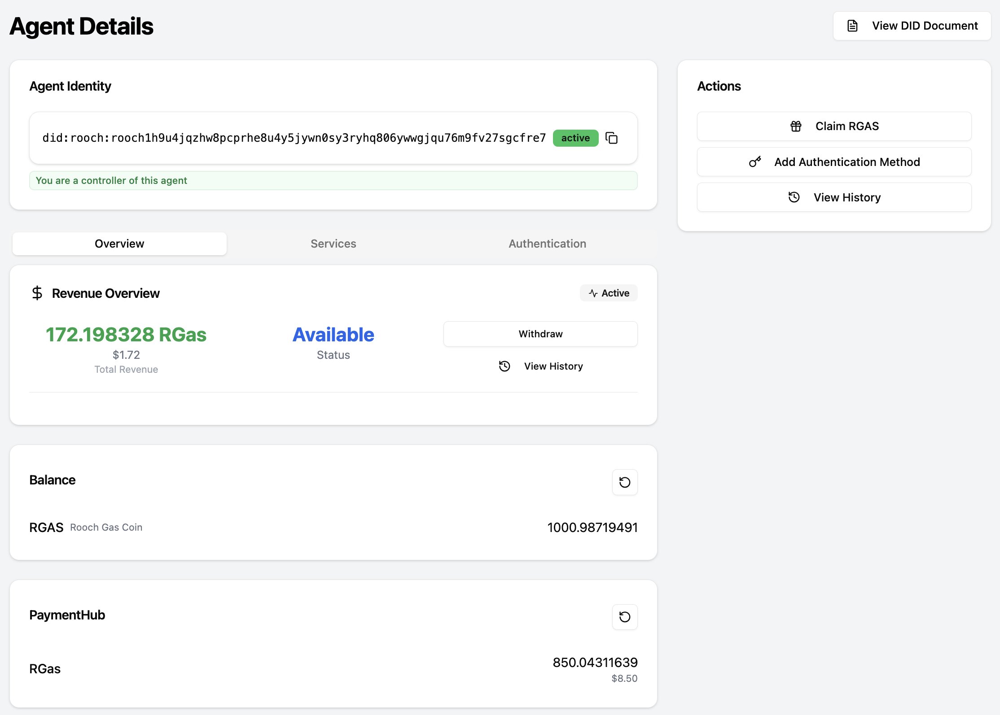

## Overview

Revenue comes from paid Nuwa service calls (e.g., MCP tools, LLM Gateway requests). When a service's payment channel reaches the configured threshold, it automatically claims into the Agent's Revenue Hub.

Permissions:

- Anyone can view revenue information.
- Withdraw operations require controller permission of the Agent DID.

## Prerequisites

- Completed the <a href="/build-caps/service-key">Service Key</a> setup.
- Service added to the Agent DID and healthy.
- Client calls to your service have been made (MCP client, LLM Gateway client, or other Nuwa-compatible client).

## Quick Start

1. Open Dashboard → select your Agent → open the Revenue card.
2. Check balances and USD estimation; click "View History" for events.
3. If you are a controller, click "Withdraw", choose asset and amount, preview fees, and confirm.

## Concepts & Metrics

- Revenue Hub: balances are tracked per `assetId`.
- USD Estimation: derived from picoUSD price provider (may be cached; considered indicative).
- Events: `RevenueDepositedEvent`, `RevenueWithdrawnEvent`, `RevenueHubCreatedEvent` (displayed as Deposited/Withdrawn/HubCreated in UI).
- Auto-claim: the service claims to the hub once a channel reaches the threshold.

## Workflows

- Generate revenue: client calls → pricing applies → channel reaches threshold → auto-claim → balance increases.
- Withdraw: controller opens modal → preview → submit → wait for confirmation → balance updates.

## Troubleshooting

- No revenue: no calls, missing pricing, threshold not reached, service offline, invalid Service Key.
- Withdraw fails: insufficient balance/fees, not controller.

## Related

<CardGroup cols={2}>
  <Card title="Service Key" icon="key" href="/build-caps/service-key">
    Obtain and configure SERVICE_KEY for your service DID
  </Card>
  <Card title="MCP Pricing" icon="dollar-sign" href="/build-caps/mcp-pricing">
    Configure pricing for MCP tools
  </Card>
  <Card title="MCP Proxy" icon="git-merge" href="/build-caps/mcp-proxy">
    Proxy existing MCP servers with payment
  </Card>
  <Card title="MCP Server" icon="server" href="/build-caps/mcp-server">
    Build a paid MCP server directly
  </Card>
</CardGroup>

