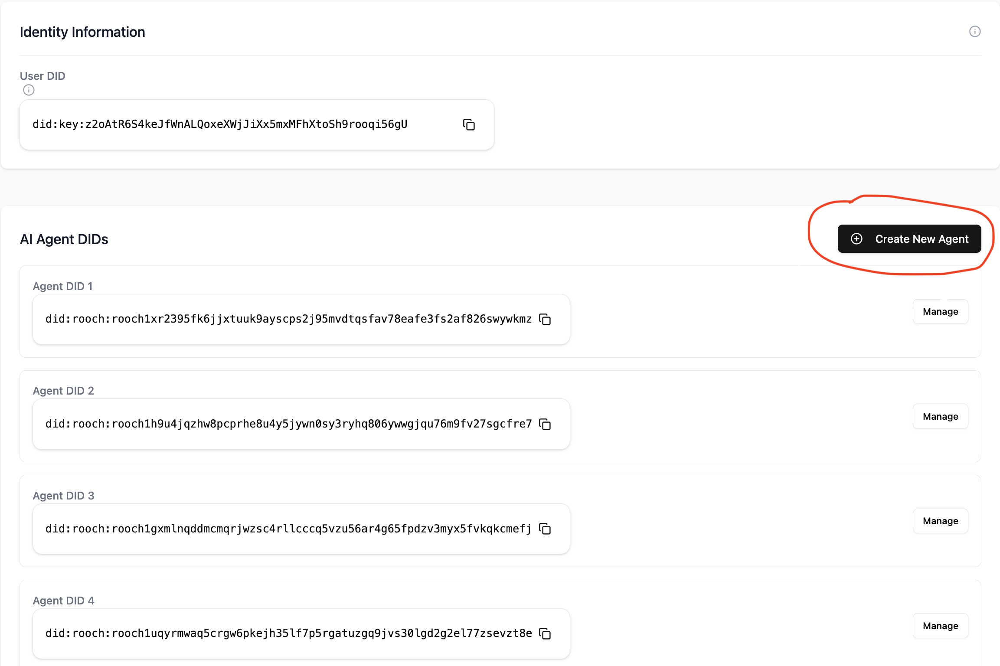
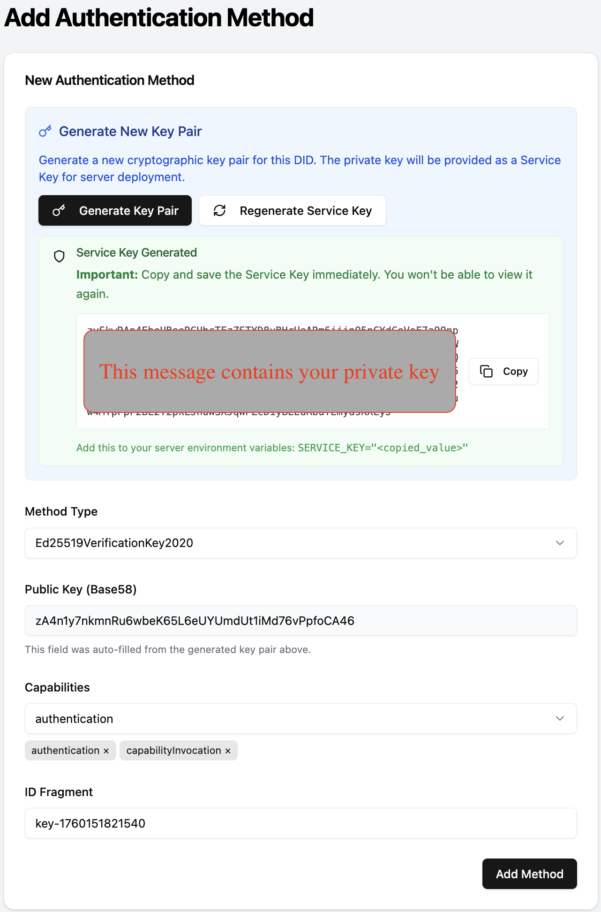
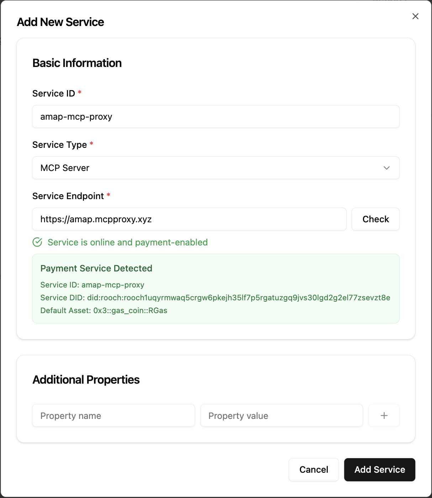

## Overview

A Service Key is the serialized private key for a service-owned DID. It enables Nuwa services (e.g., MCP Server/Proxy, LLM Gateway) to authenticate/authorize, price requests, and settle revenue. We strongly recommend using a dedicated service DID, not your client/user DID.

## Prerequisites

- Access to [https://test-id.nuwa.dev](https://test-id.nuwa.dev) (cadop-web)
- A modern browser with Passkey or wallet support

## Step 1 — Create a service-dedicated Agent DID

1. Sign in at [https://test-id.nuwa.dev](https://test-id.nuwa.dev).
2. Follow the onboarding to create an Agent DID (the app will claim minimal RGas automatically).
3. You will get an Agent DID like `did:rooch:...`.



## Step 2 — Generate ServiceKey and write to DID Document

1. Open the Agent detail page → click "Add Authentication Method".
2. Click "Generate Key Pair" to create a service key pair.
3. Capabilities: select `authentication` and `capabilityInvocation`.
4. Submit to write the verification method to your DID Document.
5. Copy the generated Service Key immediately (it is shown only once) and store it securely.





## Step 3 — Configure environment and start your service

Use the copied key as `SERVICE_KEY`:

```bash
export SERVICE_KEY="<paste_the_copied_value>"
```

- MCP Server: see the "Set environment variables and run" step in the MCP Server guide.
- MCP Proxy: set `serviceKey: "${SERVICE_KEY}"` in your `config.yaml`.
- Other services (e.g., LLM Gateway): set `SERVICE_KEY` according to that service's configuration.

Security tips:

- Inject via env vars; never commit keys to source control.
- Rotate keys periodically and separate keys per environment (dev/test/prod).

## Step 4 — Add your service to the DID (Service record)

1. In the Agent detail page, open Services → "Add Service".
2. Enter your service endpoint (e.g., `https://your.domain/mcp`).
3. Ensure the well-known health check passes, then save.



## Step 5 — Verify and see revenue

1. Call your service using an appropriate client. For MCP-based services you can also use Cap Studio's MCP Debug tool.
2. When channel revenue reaches the claim threshold, the service auto-claims.
3. View balances, withdraw funds, and audit history in the [Revenue dashboard](/build-caps/revenue).

## Troubleshooting

- Passkey/wallet not available: try another browser or re-register.
- Insufficient gas: wait for faucet claim or retry.

## Best Practices

- Environment isolation (dev/test/prod).
- Secure backups of ServiceKey.

## Related

<CardGroup cols={2}>
  <Card title="MCP Server" icon="server" href="/build-caps/mcp-server">
    Build a pay‑per‑call MCP server directly using the Payment Kit
  </Card>
  <Card title="MCP Proxy" icon="git-merge" href="/build-caps/mcp-proxy">
    Turn existing MCP into pay‑per‑call with the Proxy
  </Card>
  <Card title="Revenue" icon="dollar-sign" href="/build-caps/revenue">
    View balances, withdraw, and audit history
  </Card>
</CardGroup>


