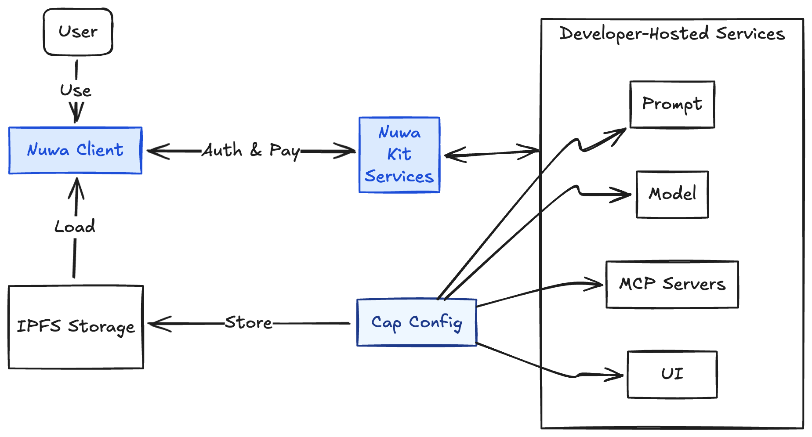

## What Is A Cap?

A Cap (capability) is the minimum functional unit in Nuwa. At its core, a Cap is a simple descriptive config file that points to the developer hosted AI services for the Nuwa Client to run. 

The core of a cap are four pieces:
- Prompt: system prompt with optional variables
- Model: the model/provider configuration the Cap runs with
- MCP servers: optional Model Context Protocol tools the Cap can call
- Artifact: optional URL to a UI (iframe) that renders rich experiences




When the user uses a cap on Nuwa Client, the client load the Cap data from IPFS by ID, resolve its prompt variables, initilize the MCP tools, connect to the model, show the UI, stream responses, and handle payment end-to-end.


## Cap Shape

```ts
type Cap = {
  id: string;                 // This should strictly be <author DID>:<idName>
  authorDID: string;         // e.g. "did:rooch:0x..."
  idName: string;            // lowercase [a-z0-9_], 6-20 chars

  core: {
    prompt: {
      value: string;          // system prompt 
      suggestions?: string[]; // optional converstion opener prompt for the user to start using your cap
    };
    model: {
      customGatewayUrl?: string; // optional override of Nuwa LLM Gateway, for setting up your own LLM Gateway
      providerId: enum[...]  // the providerId of the model, this is used for the Nuwa Client to determine the fomr of LLM API to use
      modelId: string;        // e.g. "openai/gpt-4o-mini"
      parameters?: Record<string, any>; // optional parameters of the model
      supportedInputs: ('text'|'image'|'file'|'audio')[]; // the input types that the model supports
      contextLength: number;  // the context length of the model
    };
    mcpServers: Record<string, string>; // name -> MCP server URL (only Streamable HTTP is supported)
    artifact?: { srcUrl: string };      // optional Artifact UI url, which will be embeded as a dedicated iframe panel in the Nuwa Client
  };

  metadata: {
    displayName: string; // the display name of the cap
    description: string; // the short description of the cap
    introduction: string; // the long introduction of the cap
    tags: string[]; // the tags of the cap
    homepage?: string; // the homepage of the cap
    repository?: string; // the repository of the cap
    thumbnail?: string; // the thumbnail of the cap, only support web based url for now
  };
};
```

## Integrate Nuwa Kit

In order for your AI services to be compatible and accessible to the Nuwa Client for calling and accepting payments, you need to wrap them with a middleware or a proxy to provide additional headers and data, as well as handling payment and authentication requests sent by the Nuwa Client.

For this purpose, we have built the Nuwa Kit sdk to provide some helper functions. See the Development and SDK section for how to start building.

<CardGroup cols={2}>
  <Card title="Launch Cap" icon="hammer" href="/build-caps/quickstart">
    Publish a Cap to IPFS and make it indexable by Nuwa Client
  </Card>
  <Card title="Nuwa Kit" icon="code" href="/sdk/index">
    Nuwa Kit SDKs for wrapping your AI services with Identity and Payment.
  </Card>
</CardGroup>