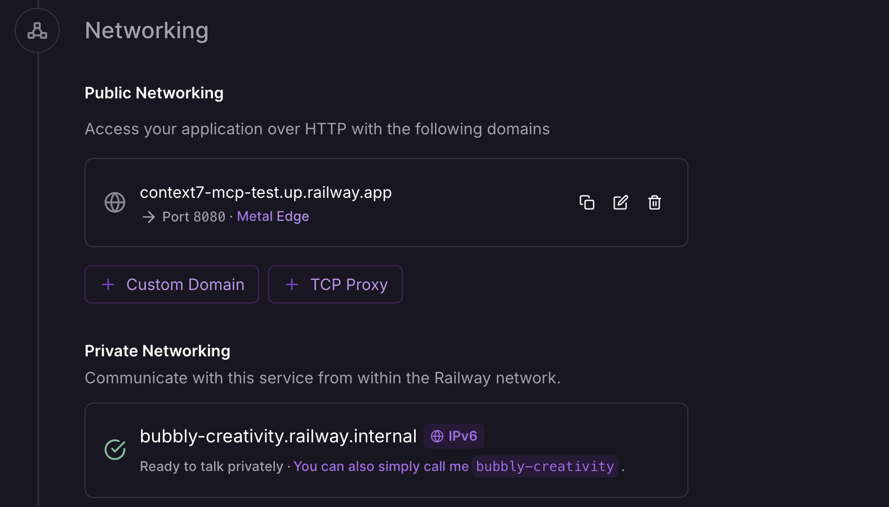

## Overview

This tutorial will guide you through deploying Nuwa MCP Server Proxy on Railway platform, enabling your MCP tools to support DID authentication and paid calls. We'll use Context7 documentation library MCP as our primary example while providing general configuration templates.

## Why Railway?

Railway is an ideal platform for deploying MCP Server Proxy:

- ✅ Full support for Node.js and child processes (stdio upstream)
- ✅ Supports long connections and real-time communication
- ✅ Simple deployment via Git integration or Docker image
- ✅ Automatic HTTPS and domain generation
- ✅ Flexible environment variable management

## Prerequisites

Before starting, ensure you have:

1. **Railway Account**: Sign up for a [Railway](https://railway.app) account
2. **Service Key**: Follow the [Service Key guide](/build-caps/service-key) to obtain your service key

## Step 1: Create Empty Service on Railway

1. Log in to Railway Dashboard
2. Click "New Project"
3. Select "Empty Service"
4. Name your service, for example: `context7-mcp`


## Step 2: Configure Environment Variables

Add the following environment variables in your Railway project's Variables page. These variables must match the placeholders used in your remote configuration file:

#### Required Variables

<ResponseField name="SERVICE_KEY" type="string" required>
Your service DID private key, obtained from the Service Key guide. Used in config as `${SERVICE_KEY}`
</ResponseField>

<ResponseField name="ROOCH_NETWORK" type="string" required>
Rooch network type (test/main). Used in config as `${ROOCH_NETWORK}`
Note: Currently only test network is supported.
</ResponseField>

<ResponseField name="DEFAULT_PRICE_PICO_USD" type="string" required>
Default tool price in picoUSD (0.0001 USD). Used in config as `${DEFAULT_PRICE_PICO_USD}`
</ResponseField>

#### Optional Variables

<ResponseField name="PORT" type="number" default="8080">
Service port, automatically set by Railway. Used in config as `${PORT}`
</ResponseField>

<ResponseField name="DEBUG" type="boolean" default="false">
Enable debug logging. Used in config as `${DEBUG}`
</ResponseField>

<Note>
Environment variables must match the placeholders in your configuration file. For example, if your config file uses `${SERVICE_KEY}`, you must set a `SERVICE_KEY` environment variable.
</Note>

## Step 3: Use Remote Configuration File (Recommended)

Using remote configuration files is the simplest approach, eliminating the need to manage local configuration files. Add the following environment variable:

<ResponseField name="CONFIG_PATH" type="string" required>
Context7 example: `https://raw.githubusercontent.com/nuwa-protocol/nuwa-caps/main/mcp-proxy-config/context7-mcp.yaml`
</ResponseField>


### Understanding Configuration File Variables

The Context7 configuration file uses the following environment variable placeholders:

```yaml
# Context7 MCP Proxy Configuration
port: ${PORT}
endpoint: "/mcp"

upstream:
  type: "stdio"
  command: ["npx", "-y", "@upstash/context7-mcp@latest"]

serviceId: "context7-mcp-proxy"
serviceKey: "${SERVICE_KEY}"
network: "${ROOCH_NETWORK}"
defaultPricePicoUSD: "${DEFAULT_PRICE_PICO_USD}"
debug: ${DEBUG}

register:
  tools:
    - name: "resolve-library-id"
      pricePicoUSD: "0"
    - name: "get-library-docs"
      pricePicoUSD: "100000000"
```

**Important**: All `${VARIABLE_NAME}` placeholders in the configuration file must have corresponding environment variables set in Railway.


### Custom Configuration (Advanced Users)

If you need custom configuration, you can:
1. Create your own configuration file and host it on a public URL
2. Set `CONFIG_PATH` to your configuration file URL
3. Ensure the configuration file is accessible via HTTPS

## Step 4: Connect Docker Image and Deploy

### 4.1 Connect Docker Image

1. In the service settings page, find the "Source" section
2. Click "Connect" or "Deploy"
3. Select "Docker Image"
4. Enter the image address: `ghcr.io/nuwa-protocol/mcp-server-proxy:latest`
5. Click "Deploy"


### 4.2 Monitor Deployment Process

1. Railway will automatically start pulling the image and deploying
2. View deployment logs in Railway Dashboard
3. Wait for deployment to complete


### 4.3 Generate Public Domain

After successful deployment, you need to manually generate a public domain:

1. In the Railway service page, find the "Settings" tab
2. Scroll to the "Networking" section
3. Click the "Generate Domain" button
4. Railway will generate a domain for you, similar to: `https://your-project-name.railway.app`



<Note>
Railway services do not automatically generate public domains by default. You need to manually generate one to access the service from outside.
</Note>

In this example, the domain is `https://context7-mcp-test.up.railway.app`. You can use this domain to access your MCP service.

### 4.4 Service Discovery and Health Check

Verify the deployment using the Nuwa payment service discovery endpoint:

```bash
curl https://context7-mcp-test.up.railway.app/.well-known/nuwa-payment/info
```

Expected response:
```json
{
  "version": 1,
  "serviceId": "context7-mcp-proxy",
  "serviceDid": "did:rooch:0x...",
  "network": "test",
  "defaultAssetId": "0x3::gas_coin::RGas",
  "defaultPricePicoUSD": "100000000",
  "basePath": "/mcp"
}
```

You can also use the health check endpoint for simple status verification:

```bash
curl https://context7-mcp-test.up.railway.app/health
```

Expected response:
```
✓ Ok
```

## Step 5: Test MCP Tools

### 5.1 Test with Cap Studio (Recommended)

Since MCP tool calls require DID authentication, we recommend using Cap Studio's MCP Debug tool for testing:

1. Visit [Cap Studio MCP Debug Tool](https://test-app.nuwa.dev/cap-studio/mcp)
2. Enter your MCP service URL: `https://your-project-name.railway.app/mcp`
3. The tool will automatically handle DID authentication and payments
4. Test various tool calls


### 5.2 Verify Service Status

You can verify that the service is running properly using the following methods:

**Service Discovery (no authentication required):**
```bash
curl https://your-project-name.railway.app/.well-known/nuwa-payment/info
```

**Health Check (no authentication required):**
```bash
curl https://your-project-name.railway.app/health
```

**Tool List (requires authentication, recommend using Cap Studio):**
- Direct curl calls require complex DID authentication flow
- Recommend using [Cap Studio MCP Debug Tool](https://test-app.nuwa.dev/cap-studio/mcp) for testing
- Cap Studio automatically handles authentication, payments, and tool calls

## Troubleshooting

### Deployment Failure

**Issue**: Docker container fails to start

**Solutions**:
1. Check Railway deployment logs
2. Verify `SERVICE_KEY` environment variable is correctly set
3. If using `CONFIG_PATH`, confirm the path is correct
4. Ensure all environment variables match the placeholders in your configuration file
5. Check environment variable format is correct (boolean values should be `true`/`false`, not `"true"`/`"false"`)

### Cannot Access Service

**Issue**: Service deployed successfully but cannot be accessed externally

**Solutions**:
1. Confirm public domain has been generated (Settings → Networking → Generate Domain)
2. Check if service is running
3. Verify port configuration is correct
4. Review Railway service logs

### Upstream Connection Failure

**Issue**: Cannot connect to upstream MCP service

**Solutions**:
1. Verify upstream URL and authentication information
2. Check network connectivity
3. Confirm upstream service health status
4. Review proxy logs

## Next Steps

After successful deployment, you can:

1. **Build a Cap**: Use [Cap Studio](/build-caps/quickstart) to create a Cap that uses your MCP proxy
2. **Monitor Revenue**: View tool call revenue through the [Revenue dashboard](/build-caps/revenue)
3. **Optimize Pricing**: Adjust [tool pricing](/build-caps/service-pricing) based on usage
4. **Expand Functionality**: Add more MCP tools or create custom MCP services

## Related Documentation

<CardGroup cols={2}>
  <Card title="MCP Proxy Overview" icon="right-left" href="/build-caps/mcp-proxy">
    Learn about MCP Proxy concepts and configuration
  </Card>
  <Card title="Service Key" icon="key" href="/build-caps/service-key">
    Obtain and configure SERVICE_KEY
  </Card>
  <Card title="Service Pricing" icon="dollar-sign" href="/build-caps/service-pricing">
    Configure pricing strategies for MCP tools
  </Card>
  <Card title="Revenue" icon="money-bill-wave" href="/build-caps/revenue">
    View and manage service revenue
  </Card>
</CardGroup>
