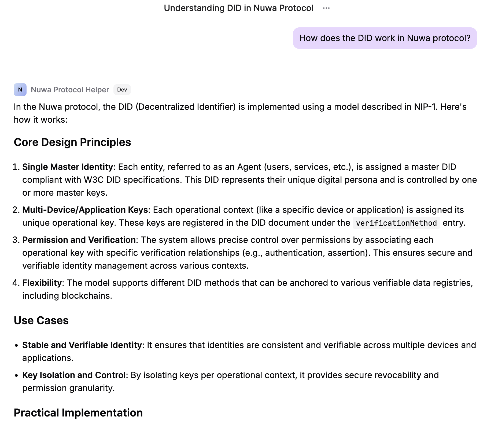

## Overview

This tutorial demonstrates how to use Nuwa LLM Gateway combined with OpenAI's File Search functionality to build a paid professional knowledge retrieval service. We'll use Nuwa Improvement Proposals (NIPs) as our knowledge base, showing how to transform specialized technical documentation into a profitable AI service.

### Live Example

You can see a working example of this approach in action: [Nuwa Protocol Helper](https://test-app.nuwa.dev/explore/caps/did:rooch:rooch1xr2395fk6jjxtuuk9ayscps2j95mvdtqsfav78eafe3fs2af826swywkmz:nuwa_protocol_helper) - a Cap that provides expert assistance with Nuwa protocol questions using the same techniques described in this tutorial.

### Why Choose Specialized Documentation?

Through experimentation, we've found that for publicly available and well-known documents, Vector Store enhancement often doesn't outperform AI + search combinations. However, Vector Store provides significant value improvement in two scenarios:

1. **Private Documentation** - Internal documents that AI cannot access through public channels
2. **New Documentation** - Latest documents not yet included or insufficiently covered in AI training data

Nuwa Improvement Proposals (NIPs) perfectly fit these criteria, making them an ideal choice for demonstrating Vector Store value.

### Expected Effect Comparison

**With Vector Store Enhancement:**
- Provides specific configuration file examples and parameter explanations
- References accurate environment variable names and values
- Offers detailed troubleshooting steps and solutions
- Includes actual deployment commands and verification methods

**Generic AI Responses:**
- Only provides general conceptual explanations
- Cannot give Nuwa-specific configuration parameters
- Lacks targeted deployment and troubleshooting guidance
- Missing specific code examples and commands

## Prerequisites

Before starting this tutorial, ensure you have:

1. **API Keys**: Service Key and OpenAI API Key
2. **Cloud Platform Access**: Railway account (or other cloud platform) for deploying your LLM Gateway
3. **Basic Knowledge**: Familiarity with Nuwa ecosystem and Cap Studio

### 1. Obtain Required API Keys

<Steps>
<Step title="Get Service Key">

Follow the [Service Key guide](/build-caps/service-key) to create your service DID and obtain a Service Key:

</Step>

<Step title="Get OpenAI API Key">

1. Visit [OpenAI Platform](https://platform.openai.com/)
2. Create an API Key
3. Ensure your account has sufficient balance for File Search functionality

</Step>
</Steps>

### 2. Prepare Documentation Files

We'll use Nuwa Improvement Proposals (NIPs) as our knowledge base. NIPs are technical specifications that define core Nuwa protocols, containing detailed technical specifications, implementation requirements, and protocol definitions that are not well-covered in general AI training data.

The NIP documents are located in the `nips/nips/` directory of the Nuwa repository and include:

- **NIP-0** - NIP Purpose and Guidelines
- **NIP-1** - Agent Single DID Multi-Key Model
- **NIP-2** - DIDAuth v1 Authentication Protocol
- **NIP-3** - Custodian-Assisted DID Onboarding Protocol (CADOP)
- **NIP-4** - Unidirectional Payment Channel Core
- And other protocol specifications...

These documents are perfect for demonstrating Vector Store value because they contain Nuwa-specific technical details that generic AI models have limited knowledge about.

## Step 1: Create OpenAI Vector Store

<Steps>
<Step title="Login to OpenAI Platform">

Visit [OpenAI Platform](https://platform.openai.com/) and log into your account.

</Step>

<Step title="Create Vector Store">

1. Find the "Storage" section in the left navigation bar
2. Click "Vector stores"
3. Click "Create vector store"
4. Name your vector store, for example: "Nuwa Docs"
5. Click "Create"

</Step>

<Step title="Upload Documentation Files">

Upload NIP documentation to Vector Store:

Since OpenAI Vector Store doesn't directly support `.md` files, you need to convert them to a supported format:

**Method A: Convert to TXT files (Recommended)**
1. Navigate to the `nips/nips/` directory in your Nuwa repository
2. For each NIP file (nip-0.md, nip-1.md, nip-2.md, etc.):
   - Copy the content of the `.md` file
   - Create a new `.txt` file with the same name (e.g., `nip-1.txt`)
   - Paste the content (Markdown syntax will be preserved as plain text)
3. Upload all `.txt` files to Vector Store

**Method B: Use OpenAI API (Advanced)**
If you're comfortable with API calls, you can use the OpenAI API to upload files programmatically, which supports more formats.

**Method C: Batch Convert with Script**
```bash
# Simple bash script to convert all .md files to .txt
cd nips/nips/
for file in *.md; do
    cp "$file" "${file%.md}.txt"
done
```

**Upload Process:**
1. In the created vector store page, click "Add files"
2. Select all converted `.txt` files
3. Upload them to the Vector Store
4. Wait for file processing to complete

**Tip**: The content remains the same regardless of file extension - OpenAI's processing will understand the Markdown formatting within the text files.


</Step>

<Step title="Record Vector Store ID">

After upload completion, record your Vector Store ID (format like `vs_xxx`), which will be used in subsequent configuration.

</Step>
</Steps>

## Step 2: Deploy LLM Gateway to Production

<Steps>
<Step title="Deploy to Railway">

Before creating the Cap, we need a production LLM Gateway. Follow the [LLM Gateway Railway deployment guide](/tutorials/deploy-llm-gateway-railway) to:

1. Create a Railway service
2. Deploy using Docker image: `ghcr.io/nuwa-protocol/llm-gateway:latest`
3. Configure environment variables:
   - `SERVICE_KEY`: Your Nuwa service key
   - `OPENAI_API_KEY`: Your OpenAI API key
   - `ROOCH_NETWORK`: Set to `testnet` or `mainnet`
4. Generate a public domain (e.g., `https://your-gateway.up.railway.app`)

**Save your gateway URL** - you'll need it for Cap configuration.

</Step>
</Steps>

## Step 3: Create Knowledge Retrieval Cap in Cap Studio

<Steps>
<Step title="Access Cap Studio">

1. Open [Nuwa Client Beta](https://test-app.nuwa.dev/)
2. Login with device passkey and create DID
3. Go to Settings → System → Enable Developer Mode
4. Find and click "Cap Studio" in the sidebar

</Step>

<Step title="Create New Cap">

1. Click "New Cap" in Cap Studio
2. Choose to use the online editor (recommended)


</Step>

<Step title="Configure Basic Information">

Fill in the Cap's basic information:

- **Cap Name**: `nuwa_protocol_helper`
- **Display Name**: `Nuwa Protocol Helper`
- **Description**: `Technical helper for Nuwa protocol specifications and NIPs`
- **Tags**: `Tools`

</Step>

<Step title="Configure Prompt">

Set the system prompt:

```text
You are a technical assistant specializing in Nuwa protocol specifications and Nuwa Improvement Proposals (NIPs). You have access to official NIP documents that define the core protocols of the Nuwa ecosystem.

Please answer user questions based on the provided NIP documentation, and in your responses:
1. Reference specific NIP numbers and sections
2. Explain technical concepts clearly with examples
3. Cite exact protocol specifications and requirements
4. Provide implementation guidance when relevant

Please respond in the same language as the user's question, but keep technical terms and code examples in English.
```

**Prompt Suggestions**:
- `How does the DID work in Nuwa protocol?`
- `What are the verification relationships in Nuwa DID?`
- `How does the payment channels work in Nuwa protocol?`
</Step>

<Step title="Configure Model">

Select model configuration:

- **Provider**: `openai_responses`
- **Model**: `gpt-4o`
- **Custom Gateway URL**: `https://your-gateway.up.railway.app` (use your actual Railway domain)
- **Supported Inputs**: `text`
- **Context Length**: `128000`

**Important**: Choose `openai_responses` instead of `openai_chat_completion` because we need to use OpenAI's Responses API to support File Search functionality.

</Step>

<Step title="Configure File Search Tool">

In the Model configuration Parameters section, add the File Search tool:

```json
{
  "tools": [
    {
      "type": "file_search",
      "vector_store_ids": ["vs_xxx"],  // Replace with your Vector Store ID
      "max_num_results": 10,
      "ranking_options": {
        "ranker": "auto"
      }
    }
  ]
}
```


</Step>


</Steps>

## Step 4: Test and Verify Effects

<Steps>
<Step title="Save and Test Cap">

1. Click "Save" in Cap Studio to save the configuration
2. Click "Test" to enter test mode
3. Start testing various NIP-related questions, such as:
   - "How does DIDAuth v1 authentication work in Nuwa?"
   - "What are the key components of Nuwa's payment channel protocol?"



</Step>

<Step title="Effect Comparison Verification">

To verify the value of Vector Store, you can:

1. **First disable File Search**: Temporarily remove tools configuration and test the same questions
2. **Record generic responses**: Observe the generic responses given by AI
3. **Re-enable File Search**: Restore tools configuration
4. **Compare professional responses**: Observe specific responses based on documentation

You should clearly see:
- Responses are more specific and accurate after enabling File Search
- Include actual configuration parameters and command examples
- Provide targeted troubleshooting steps
- Reference specific documentation content and best practices

</Step>
</Steps>

## Step 5: Publish Cap and Start Monetizing

<Steps>
<Step title="Improve Cap Information">

Before publishing, enhance your Cap:

1. **Add thumbnail**: Upload a representative image
2. **Improve introduction**: Detailed description of Cap functionality and use cases
3. **Set tags**: Add relevant tags for easier discovery
4. **Configure pricing**: Set reasonable prices through LLM Gateway pricing configuration

</Step>


<Step title="Submit to Cap Store">

1. Click "Submit to Store" in Cap Studio
2. Review and confirm all information
3. The Cap will be published immediately after confirmation (no approval process needed)
4. Your Cap will be visible in the Cap Store right away

</Step>

<Step title="Promote Your Cap">

1. **Share with target users**: Promote to Nuwa developers and blockchain community
2. **Collect user feedback**: Optimize response quality based on usage
3. **Continuously update documentation**: Keep Vector Store documents up to date

</Step>
</Steps>

## Revenue Management

<Steps>
<Step title="Monitor Usage">

Monitor your Cap usage through the following methods:

1. **LLM Gateway logs**: View request logs and usage statistics
2. **OpenAI usage statistics**: Check File Search usage in OpenAI Platform
3. **Nuwa revenue panel**: View revenue statistics in Agent DID page

</Step>

<Step title="View and Withdraw Revenue">

Manage your revenue according to the [Revenue guide](/build-caps/revenue):

</Step>

<Step title="Optimize Pricing Strategy">

Adjust pricing based on usage:

1. **Analyze user behavior**: Which questions are most frequently asked
2. **Evaluate response quality**: Complex questions can be priced higher
3. **Adjust Gateway configuration**: Use `PRICING_MULTIPLIER` to adjust overall pricing
4. **A/B testing**: Try different price points to find optimal balance

</Step>
</Steps>

## Extension and Optimization

### Add More Documentation

You can continue expanding your Vector Store with additional Nuwa documentation:

1. **SDK Documentation** - Add Nuwa Kit documentation (Identity Kit, Payment Kit, Cap Kit, UI Kit)
2. **Implementation examples** - Include code examples and reference implementations from the repository
3. **Protocol updates** - Keep NIPs updated with latest revisions as they evolve
4. **Build guides** - Add protocol specifications, LLM Gateway, and other service documentation

### Optimize Retrieval Effectiveness

1. **Document structuring**: Ensure documents have clear titles and sections
2. **Add metadata**: Add tags and classification information to documents
3. **Regular updates**: Keep documents in Vector Store up to date
4. **User feedback**: Optimize document content based on user questions

## Troubleshooting

### Common Issues

**File Search not working**
- Check if Vector Store ID is correct
- Confirm documents have been successfully uploaded and processed
- Verify OpenAI API Key has sufficient permissions and balance
- Ensure files are in supported format (TXT, PDF, DOC, etc.) - MD files need conversion

**LLM Gateway connection failure**
- Check if SERVICE_KEY is correctly set
- Confirm network configuration and ports have no conflicts
- Review Gateway logs to troubleshoot specific errors

**Cap testing failure**
- Verify Custom Gateway URL configuration is correct
- Check if Model Provider selected `openai_responses`
- Confirm tools configuration format is correct

**Revenue not showing**
- Confirm users actually used your Cap
- Check if payment channels are correctly configured
- Revenue panel updates may have delays

## Summary

Through this tutorial, you have learned:

1. **Identify high-value documents**: Choose private or new documents as Vector Store content
2. **Build knowledge services**: Use LLM Gateway + OpenAI File Search to create professional Q&A services
3. **Achieve business closure**: Complete process from technical implementation to revenue management
4. **Optimize user experience**: Provide more accurate answers than generic AI through professional documentation

This pattern can be applied to any professional domain:

- **Enterprise internal documentation**: Provide internal knowledge retrieval for company employees
- **Technical documentation services**: Provide professional Q&A for specific technology stacks for developers
- **Regulatory compliance assistant**: Provide compliance guidance based on latest regulatory documents
- **Medical knowledge base**: Provide clinical guideline retrieval for medical professionals

The key is to choose professional documents that generic AI cannot cover well, so as to demonstrate the true value of Vector Store and provide professional services worth paying for users.

### Live Implementation Example

For a real-world implementation of these concepts, check out the [Nuwa Protocol Helper](https://test-app.nuwa.dev/explore/caps/did:rooch:rooch1xr2395fk6jjxtuuk9ayscps2j95mvdtqsfav78eafe3fs2af826swywkmz:nuwa_protocol_helper) Cap in the Cap Store. This Cap demonstrates how to successfully monetize specialized technical knowledge using the exact approach described in this tutorial.

## Related Documentation

<CardGroup cols={2}>
  <Card title="Service Key" icon="key" href="/build-caps/service-key">
    Obtain and configure SERVICE_KEY
  </Card>
  <Card title="LLM Gateway" icon="server" href="/build-caps/llm-gateway">
    LLM Gateway detailed configuration guide
  </Card>
  <Card title="Revenue" icon="money-bill-wave" href="/build-caps/revenue">
    View and manage service revenue
  </Card>
  <Card title="MCP Proxy" icon="right-left" href="/build-caps/mcp-proxy">
    MCP Proxy overview and configuration
  </Card>
</CardGroup>
