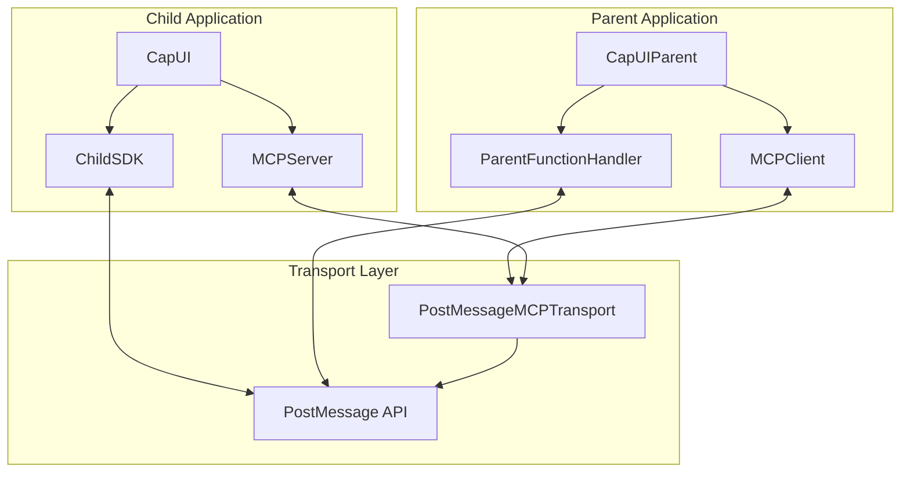

# CapUI Kit 代码架构文档

本文档详细介绍 CapUI Kit 的代码结构、各文件功能和相互关系。

## 📁 项目结构总览

```
packages/capui-kit/src/
├── index.ts                    # 主导出文件 - 所有公共API入口
├── embed-ui/                   # 嵌入式UI组件 (简化版本)
│   ├── cap-ui-embed.ts        # 基础嵌入UI类
│   └── use-cap-ui-embed.ts    # React Hook版本
└── artifact-ui/               # MCP集成版本 (核心功能)
    ├── cap-ui-mcp.ts          # Child应用主类
    ├── cap-ui-parent.ts       # Parent应用主类
    ├── child/
    │   └── sdk.ts             # Child SDK - 直接调用Parent函数
    ├── mcp/                   # MCP核心实现
    │   ├── types.ts           # 类型定义
    │   ├── client.ts          # MCP客户端
    │   ├── server.ts          # MCP服务端
    │   └── transport/
    │       └── postmessage.ts # PostMessage传输层
    └── parent/
        └── function-handler.ts # Parent函数处理器
```

## 🏗️ 核心架构

### 双重架构设计

CapUI Kit 采用**双重架构**设计：

1. **MCP 架构** - 用于AI工具发现和调用
2. **直接调用架构** - 用于Parent函数调用（sendPrompt等）



## 📄 文件详解

### 🎯 主要入口文件

#### `src/index.ts`
**作用**: 统一导出所有公共API
```typescript
// 功能分类导出:
// 1. 嵌入式UI (简化版)
export { CapEmbedUIKit } from "./embed-ui/cap-ui-embed"
export { useCapEmbedUIKit } from "./embed-ui/use-cap-ui-embed"

// 2. MCP实现 (完整功能)
export { MCPClient, MCPServer, PostMessageMCPTransport }
export { CapUIParent as CapUIMCPParent } from "./artifact-ui/cap-ui-parent"
export { CapUI as CapUIMCP } from "./artifact-ui/cap-ui-mcp"

// 3. 类型定义
export type { MCPMessage, StreamingAIResponse, ... }
```

### 🧩 嵌入式UI (简化版本)

#### `src/embed-ui/cap-ui-embed.ts`
**作用**: 基础嵌入式UI类，提供简单的iframe通信
```typescript
export class CapEmbedUIKit {
  // 基础功能:
  - sendMessage()      // 发送消息给parent
  - onReceiveMessage() // 接收parent消息
  - 简单的postMessage通信
  - 无MCP协议，无流式支持
}
```

#### `src/embed-ui/use-cap-ui-embed.ts`  
**作用**: React Hook版本的嵌入式UI
```typescript
export function useCapEmbedUIKit(options) {
  // React集成:
  - 使用useState管理连接状态
  - 使用useEffect处理生命周期
  - 返回CapEmbedUIKit实例和状态
}
```

### 🚀 MCP集成版本 (核心功能)

#### `src/artifact-ui/cap-ui-mcp.ts` 
**作用**: Child应用的主类，集成了MCP Server和Child SDK

```typescript
export class CapUI implements ParentFunctions {
  private mcpServer: MCPServer        // 暴露工具给AI
  private childSDK: ChildSDK          // 直接调用parent函数
  private transport: PostMessageMCPTransport  // 通信层
  
  // 双重功能:
  // 1. 工具注册 (MCP Server)
  registerTool()           // 注册AI工具
  registerResource()       // 注册资源
  
  // 2. Parent调用 (Child SDK)  
  sendPrompt()            // 发送提示词
  sendPromptStreaming()   // 流式提示词
  sendMessage()           // 发送消息
  getContext()            // 获取上下文
}
```

**生命周期**:
1. 初始化transport和server
2. 与parent建立连接 
3. 启动MCP server
4. 准备接收工具调用

#### `src/artifact-ui/cap-ui-parent.ts`
**作用**: Parent应用的主类，管理多个child连接

```typescript
export class CapUIParent {
  private functionHandler: ParentFunctionHandler  // 处理child函数调用
  private childConnections: Map<...>              // 管理child连接
  
  // 核心功能:
  // 1. Child连接管理
  connectToChild()        // 连接到child iframe
  disconnectFromChild()   // 断开连接
  
  // 2. 工具发现和调用
  getAllChildTools()      // 获取所有child工具
  callChildTool()         // 调用特定工具
  routeAIRequest()        // AI请求路由
  
  // 3. 流式响应支持
  sendStreamingResponse() // 发送流式响应
}
```

**连接管理**:
- 为每个child iframe创建独立的MCP连接
- 维护工具目录和路由表
- 处理连接生命周期

### 🔧 核心组件

#### `src/artifact-ui/child/sdk.ts`
**作用**: Child应用直接调用Parent函数的SDK

```typescript
export class ChildSDK implements ParentFunctions {
  private pendingCalls: Map<...>     // 等待响应的调用
  private activeStreams: Map<...>    // 活跃的流式连接
  
  // 核心功能:
  sendPrompt()           // 普通提示词调用
  sendPromptStreaming()  // 流式提示词调用  
  sendMessage()          // 发送消息
  getContext()           // 获取上下文
  
  // 流式处理:
  handleStreamingMessage()  // 处理流式响应
  generateStreamId()        // 生成流ID
}
```

**消息流程**:
```
Child SDK → PostMessage → Parent Handler → AI Backend
       ← Streaming Response ← Parent Handler ← AI Response  
```

#### `src/artifact-ui/parent/function-handler.ts`
**作用**: 处理来自Child的直接函数调用

```typescript
export class ParentFunctionHandler {
  private rateLimiters: Map<...>      // 速率限制
  private activeStreams: Map<...>     // 流式会话管理
  
  // 安全功能:
  validateOrigin()        // 验证来源
  validateMessage()       // 验证消息格式
  checkRateLimit()        // 检查速率限制
  
  // 功能执行:
  executeFunction()       // 执行具体功能
  sendStreamingResponse() // 发送流式响应
  registerStream()        // 注册流式会话
}
```

**安全机制**:
- Origin验证
- 参数schema验证  
- 速率限制
- 消息大小限制

### 🌐 MCP核心实现

#### `src/artifact-ui/mcp/types.ts`
**作用**: 定义所有MCP相关的类型和接口

```typescript
// 核心MCP类型
interface MCPMessage        // MCP消息格式
interface MCPResponse       // MCP响应格式
interface MCPError          // MCP错误格式

// 工具定义
interface ChildToolDefinition {
  name: string
  description: string  
  schema: JSONSchema      // 参数schema
  handler: Function       // 工具处理函数
}

// 流式支持
interface StreamingAIResponse    // 流式响应
interface StreamingPromptOptions // 流式选项
type StreamingCallback           // 流式回调

// 安全策略
interface SecurityPolicy {
  allowedOrigins: string[]
  toolPermissions: Record<...>
  messageValidation: {...}
}
```

#### `src/artifact-ui/mcp/client.ts`
**作用**: MCP客户端，用于Parent发现和调用Child工具

```typescript
export class MCPClient {
  private tools: Map<string, DiscoveredTool>    // 工具缓存
  private pendingRequests: Map<...>              // 等待响应的请求
  
  // 生命周期:
  initialize()          // 初始化客户端
  close()              // 关闭客户端
  
  // 工具管理:
  discoverTools()      // 发现可用工具
  listChildTools()     // 列出工具
  callChildTool()      // 调用工具
  
  // AI集成:
  routeAIRequest()     // 路由AI请求
}
```

**工具发现流程**:
1. 发送`tools/list`请求
2. 接收工具列表响应
3. 缓存工具定义
4. 通知parent新工具可用

#### `src/artifact-ui/mcp/server.ts`
**作用**: MCP服务端，用于Child暴露工具给Parent

```typescript
export class MCPServer {
  private tools: Map<string, ChildToolDefinition>  // 注册的工具
  private resources: Map<string, any>               // 注册的资源
  
  // 工具管理:
  registerTool()       // 注册工具
  unregisterTool()     // 注销工具
  registerResource()   // 注册资源
  
  // MCP协议处理:
  handleToolsList()    // 处理工具列表请求
  handleToolCall()     // 处理工具调用请求
  handleResourceRead() // 处理资源读取请求
}
```

**协议处理**:
- `initialize` - 协议初始化
- `tools/list` - 返回工具列表
- `tools/call` - 执行工具调用
- `resources/*` - 资源操作

#### `src/artifact-ui/mcp/transport/postmessage.ts`
**作用**: 基于PostMessage的MCP传输层，符合SEP标准

```typescript
export class PostMessageMCPTransport implements Transport {
  private activeStreams: Map<...>     // 活跃连接
  private securityPolicy: SecurityPolicy  // 安全策略
  
  // 连接管理:
  establishConnection()   // 建立连接 (SEP两阶段)
  close()                // 关闭连接
  
  // 消息传输:
  send()                 // 发送MCP消息
  listen()               // 监听消息
  
  // 安全功能:
  validateOrigin()       // 验证来源
  validateMessage()      // 验证消息
}
```

**SEP两阶段连接**:
1. **Setup阶段** - 身份验证和能力协商
2. **Transport阶段** - 激活MCP协议

## 🔄 数据流分析

### 1. 工具注册流程
```
Child: registerTool() → MCPServer → store in tools Map
                                 → notify parent (optional)
```

### 2. 工具发现流程  
```
Parent: MCPClient.discoverTools() → send tools/list 
                                  → MCPServer.handleToolsList()
                                  → return tools array
                                  → cache in client
```

### 3. 工具调用流程
```
AI Request → Parent: routeAIRequest() → find child with tool
                                     → MCPClient.callChildTool()
                                     → send tools/call
                                     → MCPServer.handleToolCall()
                                     → execute tool.handler()
                                     → return result
```

### 4. 流式调用流程
```
Child: sendPromptStreaming() → ChildSDK → PostMessage
                                       → ParentFunctionHandler
                                       → execute onSendPromptStreaming()
                                       → AI Backend streaming
                                       → sendStreamingResponse() 
                                       → PostMessage chunks
                                       → ChildSDK.handleStreamingMessage()
                                       → trigger onChunk callbacks
```

## 🔐 安全机制

### Origin验证
- 每个消息都验证来源域名
- 支持精确匹配和通配符
- 拒绝未授权的消息

### 参数验证  
- JSON Schema验证工具参数
- 类型检查和必需字段验证
- 防止恶意参数注入

### 速率限制
- 按origin和功能分别限制
- 滑动窗口算法
- 防止DDoS和滥用

### 消息大小限制
- 限制单个消息最大尺寸
- 防止内存耗尽攻击

## 🎛️ 配置选项

### Parent配置
```typescript
interface CapUIParentOptions {
  allowedOrigins?: string[]           // 允许的子域名
  securityPolicy?: SecurityPolicy    // 安全策略
  onSendPrompt?: Function            // 提示词处理器
  onSendPromptStreaming?: Function   // 流式提示词处理器
  onSendMessage?: Function           // 消息处理器
  onGetContext?: Function            // 上下文处理器
}
```

### Child配置
```typescript  
interface CapUIOptions {
  parentOrigin?: string              // 父窗口域名
  allowedOrigins?: string[]          // 允许的来源
  timeout?: number                   // 超时设置
  serverInfo?: { name, version }     // 服务器信息
}
```

## 🚀 使用建议

### 1. 选择合适的版本
- **简单嵌入**: 使用 `CapEmbedUIKit` 
- **AI工具集成**: 使用 `CapUI` + `CapUIParent`
- **React应用**: 使用 `useCapEmbedUIKit`

### 2. 安全配置
- 始终配置具体的 `allowedOrigins`
- 设置合适的速率限制
- 验证工具参数schema

### 3. 性能优化
- 工具注册时机要合适
- 及时清理不用的流式连接  
- 监控连接数量和资源使用

### 4. 错误处理
- 实现完整的错误回调
- 处理网络中断和超时
- 提供用户友好的错误信息

这个架构设计支持从简单的iframe通信到复杂的AI工具集成，具有良好的扩展性和安全性。