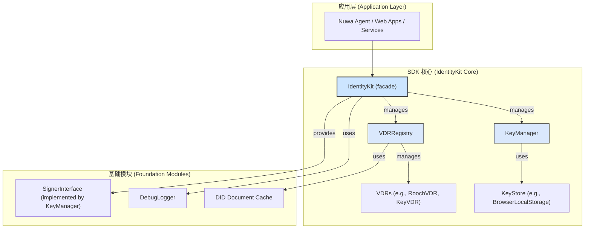

# Identity Kit: 设计与开发文档

> **目标读者**: `identity-kit` 的未来贡献者与维护者。
> **目的**: 本文档旨在阐述 `@nuwa-ai/identity-kit` 的核心设计理念、架构、关键模块以及与 Nuwa 协议（特别是 NIP-1 和 NIP-2）的集成方式。

---

## 1. 核心设计理念

`identity-kit` 是 Nuwa 协议在 TypeScript 环境下的核心身份层实现。它的首要目标是为上层应用（如 Nuwa Agent、Web 应用、后端服务）提供一套完整、易用且安全的去中心化身份（DID）管理和认证功能。

其设计遵循以下原则：

*   **NIP-1 兼容**: 严格遵循 [NIP-1: Agent 单一 DID 多密钥模型](https://github.com/nuwa-protocol/NIPs/blob/main/nips/nip-1.md) 的规范。SDK 的核心功能，如主密钥、操作密钥的管理、DID Document 的构建与解析，都围绕 NIP-1 的概念展开。
*   **NIP-2 赋能**: 为 [NIP-2: 基于 DID 的认证协议](https://github.com/nuwa-protocol/NIPs/blob/main/nips/nip-2.md) 提供基础能力。SDK 本身不强制实现特定的认证流程，但提供必要的签名和验签工具，使开发者能轻松构建符合 NIP-2 规范的认证机制。
*   **开箱即用 (Out-of-the-Box)**: 通过 `IdentityKit.bootstrap()` 或 `IdentityEnvBuilder` 一行代码即可装配 KeyStore、Signer、VDR 等依赖，让开发者快速上手。
*   **模块化与可扩展性**: 核心组件（如 `VDR`, `KeyStore`）被设计为可插拔的接口。这允许社区未来扩展支持新的 DID 方法或密钥存储方案，而无需修改核心逻辑。
*   **安全默认**: 在 API 设计上倾向于安全，例如，将敏感的链上交互参数收敛到 `advanced` 选项中，避免开发者误用。

## 2. 系统架构

`identity-kit` 的架构是分层的，自下而上依次为：



**关键组件说明**:

*   **`IdentityKit`**: SDK 的主入口和外观（Facade）。它整合了 `KeyManager` 和 `VDRRegistry` 的功能，为上层应用提供统一、简洁的 API 接口，如 `createDID()`, `sign()`, `resolveDID()` 等。
*   **`KeyManager`**: 密钥管理器。负责密钥的生成、存储、检索和使用。它实现了 `SignerInterface`，是所有签名操作的执行者。`KeyManager` 将具体的密钥存储操作委托给 `KeyStore`。
*   **`KeyStore`**: 密钥存储接口。定义了密钥的持久化存储规范。SDK 内置了 `BrowserLocalStorageKeyStore` 用于浏览器环境。该接口可被扩展以支持其他存储后端（如内存、加密文件、硬件安全模块等）。
*   **`VDRRegistry`**: VDR (Verifiable Data Registry) 注册表。用于管理不同 DID 方法的解析器（`VDR`）。例如，当需要解析 `did:rooch:...` 时，它会自动选择 `RoochVDR`。
*   **`AbstractVDR`**: VDR 的抽象基类。定义了所有 VDR 实现必须遵守的接口，如 `resolve()` 和 `update()`。`RoochVDR`, `KeyVDR`, `WebVDR` 都是它的具体实现。
*   **`SignerInterface`**: 签名者接口。定义了签名和获取公钥的标准方法，由 `KeyManager` 实现。这使得签名逻辑与具体的密钥管理和存储解耦。
*   **DID Document Cache**: SDK 内置了一个基于内存的 LRU 缓存 (`InMemoryLRUDIDDocumentCache`)，并默认在 `VDRRegistry` 中启用。这可以显著减少对 VDR 的重复请求，提高 DID 解析性能。
*   **`DebugLogger`**: 一个轻量级的调试日志器，支持不同级别的日志输出，并可在生产环境中通过 tree-shaking 移除，以减小包体积。

## 3. 核心流程实现

### 3.1 环境装配流程 (`IdentityKit.bootstrap / IdentityEnvBuilder`)

`identity-kit` 采用「先装配环境 👉 再绑定 DID」的两阶段流程。

**最简用法 – `bootstrap()`**
```ts
const env = await IdentityKit.bootstrap({
  method: 'rooch',              // 自动注册 RoochVDR
  vdrOptions: { rpcUrl: '...' } // 其他 VDR 初始化参数
});

// 加载或创建 DID
const kit = await env.loadDid(did);
```

**高级用法 – `IdentityEnvBuilder`**
```ts
const env = await new IdentityEnvBuilder()
  .useVDR('rooch', { rpcUrl: '...' })
  .useKeyStore(customStore)
  .init();
```

内部执行步骤：
1. Builder/Bootstrap 根据配置注册所需 VDR 实例到全局 `VDRRegistry`。
2. 创建 `KeyStore`（默认 LocalStorageKeyStore / MemoryKeyStore）。
3. 创建 `KeyManager` 并与 `KeyStore` 绑定。
4. 返回 `IdentityEnv`，其中持有 `registry` 与 `keyManager`，供后续 `loadDid / createDid` 使用。

### 3.2 签名与验签流程 (`SignerInterface` & `auth/v1`)

本节概述 SDK 如何在不同层级执行数据签名与验签，并给出常见使用范式。

#### 3.2.1 SignerInterface —— 低层签名抽象

* **定位**: `SignerInterface` 定义于 `src/signers/types.ts`，由 `KeyManager` 实现，也可由外部钱包 / HSM 等实现。
* **核心方法**:
  * `listKeyIds()` – 查询所有可用 `keyId`。
  * `signWithKeyId(data, keyId)` – 使用指定密钥对字节数组签名。
  * `canSignWithKeyId(keyId)` – 判断 signer 是否持有某密钥。
  * `getKeyInfo(keyId)` – 查询密钥类型及公钥。
* **示例**:

```ts
import { Bytes } from '@nuwa-ai/identity-kit';

const payload = Bytes.stringToBytes('hello world');
const signer = kit.getSigner();              // KeyManager ⇢ SignerInterface
const keyId = (await kit.getAvailableKeyIds()).authentication?.[0];
if (!keyId) throw new Error('No auth key');
const signature = await signer.signWithKeyId(payload, keyId);
```

> **⚠️ 注意**: 签名算法由 `keyId` 对应的 `VerificationMethod.type` 决定。SDK 内部通过 `algorithmToKeyType()` 辅助方法完成 **算法 → KeyType** 的映射，无需自行维护[[memory:7955943334320115518]].

#### 3.2.2 DIDAuth v1 —— 高层 NIP-2 兼容签名

为了简化基于 DID 的 HTTP 认证（[NIP-2]），SDK 提供 `auth/v1` 模块封装 DIDAuth v1 逻辑，包括:

* `createSignature()` – 生成带 `nonce` / `timestamp` 的签名对象。
* `toAuthorizationHeader()` – 将签名对象编码为 HTTP `Authorization` 头值。
* `verifySignature()` – 在服务端验证签名有效性。
* `verifyAuthHeader()` – 直接对 HTTP 头进行校验，并提供重放保护。

```ts
import { DIDAuth } from '@nuwa-ai/identity-kit';

// 1) 生成签名
const signed = await DIDAuth.v1.createSignature(
  { operation: 'transfer', params: { amount: 100 } }, // 自定义 payload
  env.keyManager,                                     // SignerInterface
  keyId                                               // 选定的 keyId
);

// 2) 转为 HTTP Authorization 头
const authHeader = DIDAuth.v1.toAuthorizationHeader(signed);

// 3) 服务端验证
const ok = await DIDAuth.v1.verifySignature(signed, env.registry);
```

**实现要点**:
1. 使用 `canonicalize()` 确保待签名 JSON 拥有确定性序列化。
2. 加入 `nonce` + `timestamp` 提供重放攻击防护（默认允许 ±300s 时钟偏移）。
3. 默认 **域分隔符** 为 `"DIDAuthV1:"`，避免不同协议间签名重复利用。

#### 3.2.3 支持的签名算法

| VerificationMethod.type | KeyType (自动推导) | 说明 |
|-------------------------|--------------------|------|
| `Ed25519VerificationKey2020` | `ED25519` | 默认首选，高性能、短签名 |
| `EcdsaSecp256k1VerificationKey2019` | `ECDSA_SECP256K1` | 兼容 EVM / BTC 生态 |
| `RoochSecp256r1` | `ECDSA_P256R1` | Rooch 链内置 |

新算法支持需:
1. 在 `crypto/providers/` 实现对应 `sign()` / `verify()`。
2. 在 `algorithmToKeyType()` 中注册映射。

---
