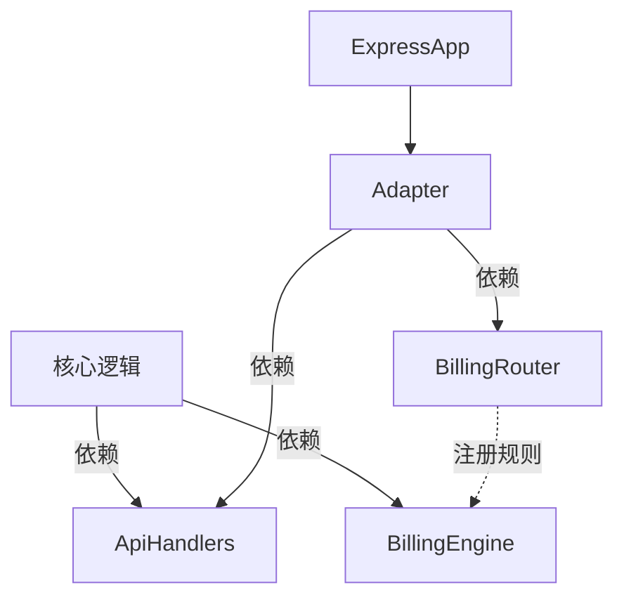

# Payment Kit 框架无关化重构方案

> 本文档描述了 **Payment Kit** 从「Express 定制实现」到「核心逻辑 / 传输层解耦」的重构设计，用于指导后续开发与迁移。

---

## 1 目标

1. **抽离内置接口逻辑**：将 `ExpressPaymentKit` 中耦合的内置接口（price、recovery、commit、admin…）提炼为纯业务 _Handler_，以便在不同 Web 框架（Express / Koa / Fastify / …）复用。
2. **统一返回值与错误格式**：服务端和客户端共用一套 `ApiResponse` / `ApiError` 类型，减少前后端协同成本。
3. **模块边界清晰**：计费核心逻辑 (`billing/*`) 与框架适配层 (`transport/<framework>/*`) 相互独立，依赖方向单向（适配层依赖核心层）。

---

## 2 分层设计

```text
payment-kit/src/
  core/               # 业务核心（BillingEngine、RateProvider、ClaimScheduler…）
  api/                # 纯业务 handler，实现各内置接口
  types/              # 跨端共享 DTO / ApiError / ErrorCode
  errors/             # PaymentKitError, toApiError
  transport/
    express/
      BillableRouter.ts            # 路由声明 + 计费规则收集（Express 专用）
      PaymentKitExpressAdapter.ts  # 将 handlers 挂载到 Express
      ExpressPaymentKit.ts         # 对外工厂，一键集成
    koa/          # 可选
    fastify/      # 可选
```

### 层次说明

| 层级 | 说明 | 是否依赖框架 |
| ---- | ---- | ------------ |
| core | 计费 / 业务核心 | ❌ |
| api  | handler 纯业务实现 | ❌ |
| transport/express/BillableRouter | 路由注册 + 计费规则收集，内部持有 `express.Router()`，因此**仅**在 Express 场景使用 | ✅ Express |
| transport/* | 将 handler + Router + 中间件 "接线" 到具体框架，并负责统一响应结构 | ✅ 对应框架 |

---

## 3 关键组件

### 3.1 Handler 接口

```ts
export interface ApiResponse<T = unknown> {
  success: boolean;
  data?: T;
  error?: ApiError;
  timestamp: string;
}

export interface ApiError {
  code: ErrorCode;
  message: string;
  details?: unknown;
}

export enum ErrorCode {
  UNAUTHORIZED = 'UNAUTHORIZED',
  NOT_FOUND = 'NOT_FOUND',
  PAYMENT_REQUIRED = 'PAYMENT_REQUIRED',
  CONFLICT = 'CONFLICT',
  INTERNAL_ERROR = 'INTERNAL_ERROR',
}

export type Handler<Ctx = any, Req = any, Res = any> =
  (ctx: Ctx, req: Req) => Promise<ApiResponse<Res>>;
```

### 3.2 PaymentKitExpressAdapter（示意）

```ts
import { Router } from 'express';
import { BuiltInApiHandlers } from '../../api';
import { toApiError } from '../../errors';
import type { IBillingRuleRegistry } from '../../billing';

export function createExpressAdapter(
  handlers = BuiltInApiHandlers,
  ctx: ApiContext,
  registry: IBillingRuleRegistry,
): Router {
  const router = Router();

  Object.entries(handlers).forEach(([key, handler]) => {
    const [method, path] = key.split(' ');

    // 在计费规则收集器登记
    registry.register(method as any, path, { pricing: '0' });

    // 绑定路由
    (router as any)[method.toLowerCase()](path, async (req, res) => {
      try {
        const result = await handler(ctx, { ...req.query, ...req.body, params: req.params });
        res.status(200).json(result);
      } catch (err) {
        const apiErr = toApiError(err);
        res.status(apiErr.httpStatus).json({ success: false, error: apiErr, timestamp: new Date().toISOString() });
      }
    });
  });

  return router;
}
```

### 3.3 BillableRouter 与 Adapter 的依赖



---

## 4 迁移步骤

1. **创建目录**：`src/transport/express/`，并移动 `ExpressPaymentKit.ts`、`BillableRouter.ts` 至该目录。
2. **提炼 handler**：从现有 `ExpressPaymentKitImpl` 中抽出 price / recovery / commit / admin… 逻辑，放入 `src/api/handlers/`。
3. **实现统一类型**：在 `src/types/` 新建 `api.ts`，定义 `ApiResponse` / `ApiError` / `ErrorCode`。
4. **实现 `PaymentKitExpressAdapter`**：负责路由挂载、错误捕获、计费规则注册。
5. **重构 `ExpressPaymentKitImpl`**：
   - 组装 `ApiContext`（`PayeeClient`、`BillingEngine`…）；
   - `const billableRouter = new BillableRouter({ … });`
   - `const adapterRouter = createExpressAdapter(handlers, ctx, billableRouter);`
   - `this.router.use(basePath, adapterRouter);`
6. **更新客户端**：`PaymentChannelHttpClient` 的 `parseJsonResponse` 解析新 `ApiResponse`，若 `success=false` 抛出 `PaymentKitError`。
7. **测试 & 发布**：添加 e2e 测试覆盖 Express + Koa 环境，发布 Minor 版本并更新 CHANGELOG。

---

## 5 兼容性策略

- **Deprecation Warning**：在旧路径 `integrations/express/*` 保留文件，内部 `export *` 并打印迁移提示。
- **语义化版本**：目录结构变动 & 统一响应格式属于 Minor（兼容）升级，但若删除旧接口则需 Major 升级。

---

## 6 FAQ

### Q : 为什么 `billing/BillableRouter.ts` 仍依赖 `express`？
A : 其职责是“声明 HTTP 路由 + 收集计费规则”，底层直接返回 `express.Router()`，因此不可避免依赖 Express。若未来需要完全脱离 Express，可再拆分：`RuleRegistry`（无框架）+ `ExpressRouteBinder`（框架）。

### Q : 其他框架需要开发哪些文件？
A : 仅需实现 `transport/<framework>/PaymentKit<Framework>Adapter.ts`，遵循相同 `Handler` 签名与统一响应格式即可。

---

> 通过以上重构，Payment Kit 将获得更高的可维护性和可扩展性，同时保证向后兼容性，便于在多种运行环境中复用。