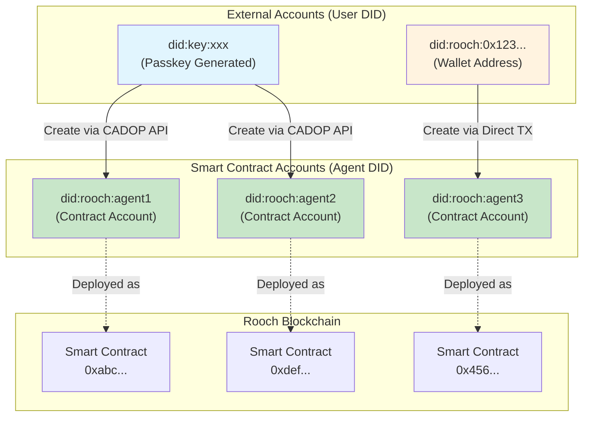
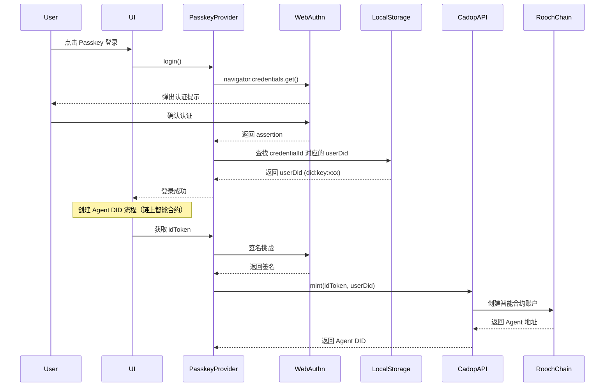
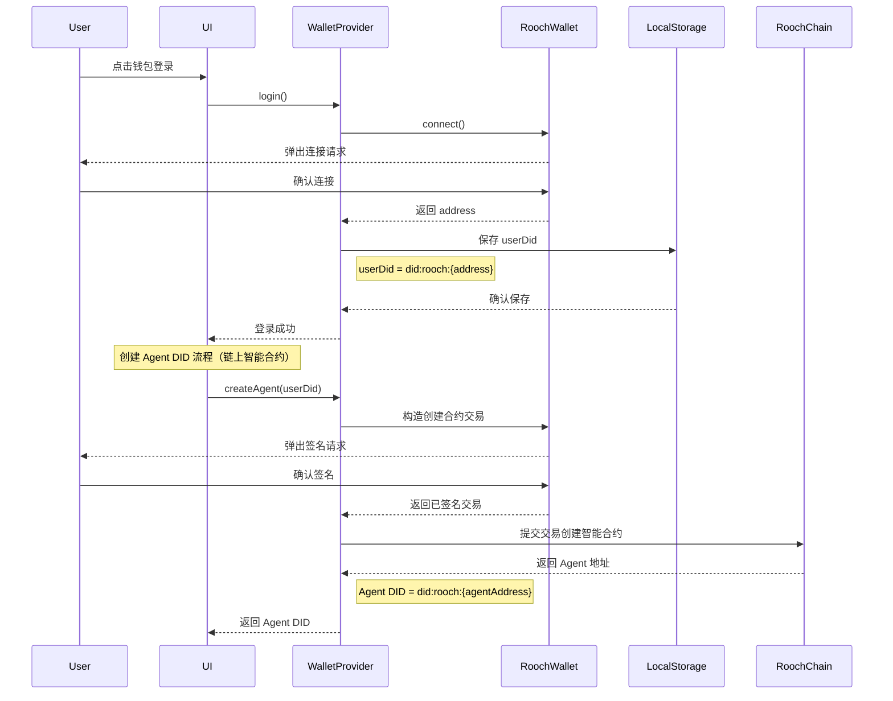
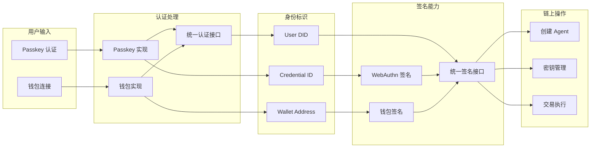

# Cadop Web 钱包认证架构图

## DID 体系架构



## 模块依赖关系

```mermaid
graph TB
    subgraph "UI Layer"
        LoginPage[Login Page]
        Dashboard[Dashboard]
        OnboardingGuard[Onboarding Guard]
    end

    subgraph "Auth Layer"
        AuthContext[Auth Context]
        AuthProvider[Auth Provider Interface]
        PasskeyProvider[Passkey Provider]
        WalletProvider[Wallet Provider]
    end

    subgraph "Signer Layer"
        SignerInterface[Signer Interface]
        WebAuthnSigner[WebAuthn Signer]
        RoochWalletSigner[Rooch Wallet Signer]
    end

    subgraph "Service Layer"
        AgentService[Agent Service]
        PasskeyAgentService[Passkey Agent Service]
        WalletAgentService[Wallet Agent Service]
        DIDService[DID Service]
    end

    subgraph "Storage Layer"
        NuwaStore[Nuwa Store]
        UserStore[User Store]
        AuthStore[Auth Store]
    end

    subgraph "External Dependencies"
        RoochSDKKit[Rooch SDK Kit]
        WebAuthnAPI[WebAuthn API]
        CadopAPI[Cadop API]
        RoochNetwork[Rooch Network]
    end

    LoginPage --> AuthContext
    Dashboard --> AuthContext
    OnboardingGuard --> AuthContext

    AuthContext --> AuthProvider
    AuthProvider <|-- PasskeyProvider
    AuthProvider <|-- WalletProvider

    PasskeyProvider --> WebAuthnSigner
    WalletProvider --> RoochWalletSigner

    WebAuthnSigner --> SignerInterface
    RoochWalletSigner --> SignerInterface

    AuthContext --> AgentService
    AgentService <|-- PasskeyAgentService
    AgentService <|-- WalletAgentService

    PasskeyAgentService --> CadopAPI
    WalletAgentService --> RoochNetwork

    PasskeyProvider --> WebAuthnAPI
    WalletProvider --> RoochSDKKit

    AuthContext --> Storage Layer
    PasskeyProvider --> Storage Layer
    WalletProvider --> Storage Layer

    DIDService --> SignerInterface
```

## 认证流程对比

### Passkey 认证流程



### 钱包认证流程



## 数据流转



## 存储结构演进

### 当前结构 (v1)

```json
{
  "version": 1,
  "currentUserDid": "did:key:xxx",
  "users": {
    "did:key:xxx": {
      "credentials": ["credId1", "credId2"],
      "agents": ["did:rooch:agent1"],
      "createdAt": 1234567890,
      "updatedAt": 1234567890
    }
  }
}
```

### 新结构 (v2)

```json
{
  "version": 2,
  "currentUserDid": "did:rooch:0x123",
  "currentAuthMethod": "wallet",
  "users": {
    "did:key:xxx": {
      "credentials": ["credId1", "credId2"],
      "agents": ["did:rooch:agent1"],
      "authMethods": [
        {
          "method": "passkey",
          "identifier": "credId1",
          "addedAt": 1234567890
        }
      ],
      "createdAt": 1234567890,
      "updatedAt": 1234567890
    },
    "did:rooch:0x123": {
      "credentials": [],
      "agents": ["did:rooch:agent2"],
      "authMethods": [
        {
          "method": "wallet",
          "identifier": "0x123...",
          "addedAt": 1234567890
        }
      ],
      "createdAt": 1234567890,
      "updatedAt": 1234567890
    }
  }
}
```

## 组件层级

```
App
├── AuthProvider (Context)
│   ├── RoochProvider
│   │   └── WalletProvider
│   └── VDRProvider
├── Routes
│   ├── LoginPage
│   │   ├── PasskeyLogin
│   │   └── WalletLogin
│   ├── Dashboard
│   │   ├── UserInfo
│   │   ├── AgentList
│   │   └── AuthMethodList
│   └── OnboardingGuard
│       ├── CreatePasskeyStep
│       ├── ConnectWalletStep
│       ├── CreateAgentStep
│       └── ClaimGasStep
└── ProtectedRoute
```
