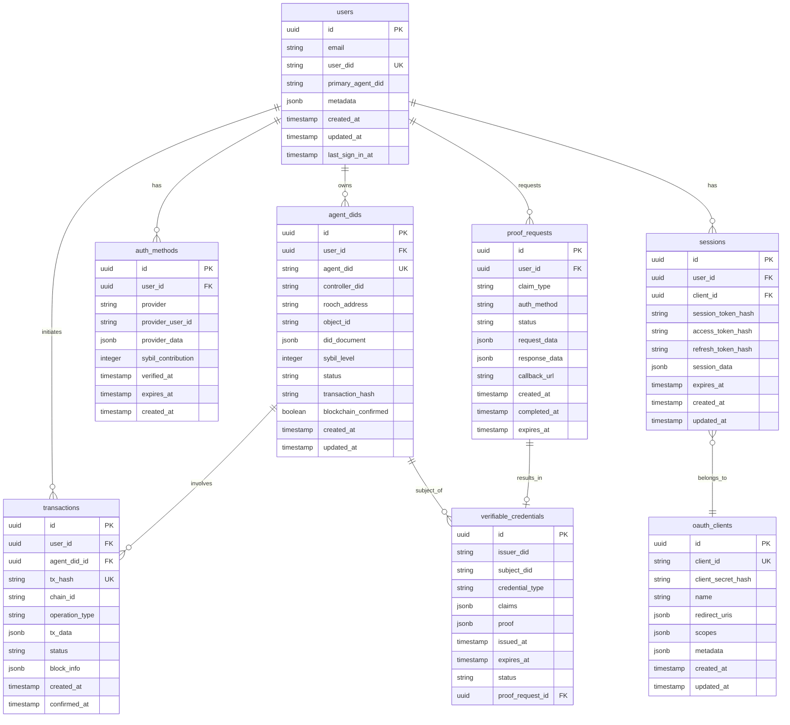

# CADOP Service 系统架构设计

## 概述

CADOP Service 是一个基于 NIP-3 规范的分布式身份服务系统，采用微服务架构设计，提供身份提供商 (IdP)、托管商 (Custodian) 和 Web2 证明服务。系统使用 Supabase 作为后端服务，集成 @nuwa-identity-kit 实现 DID 操作，支持多种认证方式，实现 Web2 到 Web3 的无缝过渡。

## 整体架构

### 系统架构图
```
┌─────────────────────────────────────────────────────────────────────────┐
│                          Client Layer                                  │
│  ┌─────────────────┐  ┌─────────────────┐  ┌─────────────────────────┐  │
│  │   Web Frontend  │  │  Mobile App     │  │   Third-party DApps     │  │
│  │   (React)       │  │  (React Native) │  │   (SDK Integration)     │  │
│  └─────────────────┘  └─────────────────┘  └─────────────────────────┘  │
└─────────────────────────────────────────────────────────────────────────┘
                                    │
                               HTTPS/WSS
                                    │
┌─────────────────────────────────────────────────────────────────────────┐
│                         API Gateway Layer                              │
│  ┌─────────────────────────────────────────────────────────────────┐   │
│  │                    Load Balancer & API Gateway                 │   │
│  │  • Rate Limiting  • Authentication  • Request Routing          │   │
│  │  • SSL Termination  • Monitoring  • CORS                       │   │
│  │  • SSL Termination  • Monitoring  • CORS                       │   │
│  └─────────────────────────────────────────────────────────────────┘   │
└─────────────────────────────────────────────────────────────────────────┘
                                    │
┌─────────────────────────────────────────────────────────────────────────┐
│                       Application Layer                                │
│                                                                         │
│  ┌─────────────────┐  ┌─────────────────┐  ┌─────────────────────────┐  │
│  │                 │  │                 │  │                         │  │
│  │  Identity       │  │  Custodian      │  │  Web2 Proof             │  │
│  │  Provider       │  │  Service        │  │  Service                │  │
│  │  Service        │  │                 │  │                         │  │
│  │                 │  │                 │  │                         │  │
│  │  • OIDC Server  │  │  • @nuwa-       │  │  • OAuth Integration    │  │
│  │  • WebAuthn     │  │    identity-kit │  │  • VC Issuance          │  │
│  │  • JWT/VC Issue │  │  • DID Minting  │  │  • Claim Verification   │  │
│  │                 │  │  • Gas Payment  │  │                         │  │
│  └─────────────────┘  └─────────────────┘  └─────────────────────────┘  │
│                                                                         │
│  ┌─────────────────┐  ┌─────────────────┐  ┌─────────────────────────┐  │
│  │                 │  │                 │  │                         │  │
│  │  Auth & Session │  │  DID Management │  │  Notification           │  │
│  │  Service        │  │  Service        │  │  Service                │  │
│  │                 │  │                 │  │                         │  │
│  │  • Supabase     │  │  • @nuwa-       │  │  • Email/SMS            │  │
│  │    Auth         │  │    identity-kit │  │  • Realtime Updates     │  │
│  │  • Session Mgmt │  │  • VDR Abstract │  │  • Push Notifications   │  │
│  │  • Client Mgmt  │  │  • DID CRUD     │  │                         │  │
│  └─────────────────┘  └─────────────────┘  └─────────────────────────┘  │
└─────────────────────────────────────────────────────────────────────────┘
                                    │
┌─────────────────────────────────────────────────────────────────────────┐
│                         Supabase Layer                                 │
│                                                                         │
│  ┌─────────────────┐  ┌─────────────────┐  ┌─────────────────────────┐  │
│  │                 │  │                 │  │                         │  │
│  │  PostgreSQL     │  │  Realtime       │  │  Auth & Storage         │  │
│  │  Database       │  │  Subscriptions  │  │                         │  │
│  │                 │  │                 │  │                         │  │
│  │  • User Data    │  │  • Live Updates │  │  • User Management      │  │
│  │  • DID Records  │  │  • WebSocket    │  │  • File Storage         │  │
│  │  • Transactions │  │  • Row Changes  │  │  • Edge Functions       │  │
│  │  • Audit Logs   │  │  • Broadcasts   │  │  • API Gateway          │  │
│  │                 │  │                 │  │                         │  │
│  └─────────────────┘  └─────────────────┘  └─────────────────────────┘  │
└─────────────────────────────────────────────────────────────────────────┘
                                    │
┌─────────────────────────────────────────────────────────────────────────┐
│                     Blockchain Integration Layer                       │
│                                                                         │
│  ┌─────────────────┐  ┌─────────────────┐  ┌─────────────────────────┐  │
│  │                 │  │                 │  │                         │  │
│  │  Rooch Network  │  │  Ethereum       │  │  Other Chains           │  │
│  │  (via @nuwa-    │  │  Mainnet        │  │                         │  │
│  │   identity-kit) │  │                 │  │  • Polygon              │  │
│  │                 │  │  • ENS          │  │  • BSC                  │  │
│  │  • DID Registry │  │  • VC Registry  │  │  • Future Chains        │  │
│  │  • Gas Payment  │  │                 │  │                         │  │
│  │  • Smart        │  │                 │  │                         │  │
│  │    Contracts    │  │                 │  │                         │  │
│  │                 │  │                 │  │                         │  │
│  └─────────────────┘  └─────────────────┘  └─────────────────────────┘  │
└─────────────────────────────────────────────────────────────────────────┘
```

## 核心模块设计

### 1. Identity Provider Service (IdP)

#### 1.1 模块职责
- 实现完整的 OIDC 服务器功能
- 支持多种 Web2 认证方式
- 颁发 ID Token 和可验证凭证
- 管理用户认证状态和 Sybil 等级
- 与 Supabase Auth 集成

#### 1.2 子模块架构
```
IdP Service
├── OIDC Core
│   ├── Authorization Server
│   ├── Token Endpoint
│   ├── UserInfo Endpoint
│   └── JWKS Management
├── Authentication Providers
│   ├── WebAuthn/Passkey
│   ├── Google OAuth
│   ├── GitHub OAuth
│   ├── Apple Sign-In
│   ├── WeChat QR
│   └── Twitter OAuth
├── Supabase Integration
│   ├── User Registration
│   ├── Session Management
│   ├── Auth State Sync
│   └── Profile Management
└── Sybil Assessment
    ├── Level Calculation
    ├── Risk Analysis
    └── Fraud Detection
```

#### 1.3 关键接口
```typescript
interface IdPService {
  // OIDC 标准端点
  authorize(request: AuthorizeRequest): Promise<AuthorizeResponse>;
  token(request: TokenRequest): Promise<TokenResponse>;
  userinfo(token: string): Promise<UserInfoResponse>;
  
  // DID 相关 (基于 @nuwa-identity-kit)
  validateDIDKey(did: string, publicKey: JWK): Promise<boolean>;
  calculateSybilLevel(authMethods: AuthMethod[]): Promise<number>;
  
  // Supabase 集成
  syncUserToSupabase(user: User): Promise<void>;
  getSupabaseSession(userId: string): Promise<SupabaseSession>;
  
  // 认证提供者管理
  authenticateWithProvider(provider: string, credentials: any): Promise<AuthResult>;
}
```

### 2. Custodian Service (基于 @nuwa-identity-kit)

#### 2.1 模块职责
- 协助用户创建和管理 DID
- 使用 @nuwa-identity-kit 进行 DID 操作
- 处理区块链交易和 Gas 支付
- 验证 ID Token 和身份证明
- 与 Supabase 同步 DID 状态

#### 2.2 子模块架构
```
Custodian Service
├── @nuwa-identity-kit Integration
│   ├── VDR Management (RoochVDR)
│   ├── CADOP Protocol Implementation
│   ├── DID Document Operations
│   └── Verification Method Management
├── DID Lifecycle Management
│   ├── Creation Orchestration
│   ├── Status Tracking
│   ├── Error Handling
│   └── Recovery Procedures
├── Supabase Synchronization
│   ├── DID Record Storage
│   ├── Transaction Logging
│   ├── Real-time Updates
│   └── Audit Trail
├── Policy Engine
│   ├── Sybil Level Validation
│   ├── Rate Limiting
│   ├── Quota Management
│   └── Risk Assessment
└── Blockchain Adapters
    ├── Gas Management
    ├── Transaction Monitoring
    └── Network Selection
```

#### 2.3 关键接口
```typescript
interface CustodianService {
  // 基于 @nuwa-identity-kit 的 DID 操作
  createDIDViaCADOP(request: CADOPCreationRequest): Promise<DIDCreationResult>;
  resolveDID(did: string): Promise<DIDDocument | null>;
  updateDIDDocument(did: string, operation: DIDOperation): Promise<boolean>;
  
  // Supabase 集成
  storeDIDRecord(didRecord: DIDRecord): Promise<string>;
  updateDIDStatus(recordId: string, status: DIDStatus): Promise<void>;
  subscribeToUpdates(callback: (update: DIDUpdate) => void): Promise<void>;
  
  // 验证和策略
  validateIDToken(token: string): Promise<ValidationResult>;
  checkQuotaLimits(userDid: string): Promise<QuotaStatus>;
  
  // 区块链操作
  payGasForTransaction(tx: Transaction): Promise<TransactionReceipt>;
  monitorTransaction(txHash: string): Promise<TransactionStatus>;
}
```

### 3. Web2 Proof Service

#### 3.1 模块职责
- 提供细粒度的 Web2 身份验证
- 颁发特定的可验证凭证
- 验证各种 Web2 平台的身份声明
- 支持第三方证明服务集成
- 与 Supabase 实时同步证明状态

#### 3.2 子模块架构
```
Web2 Proof Service
├── Proof Providers
│   ├── Email Verification
│   ├── Phone Verification
│   ├── Social Media Verification
│   └── Government ID Verification
├── VC Management (with @nuwa-identity-kit)
│   ├── VC Generation
│   ├── VC Verification
│   ├── Schema Management
│   └── Credential Registry
├── Supabase Integration
│   ├── Proof Request Storage
│   ├── Real-time Status Updates
│   ├── Evidence Storage
│   └── Audit Logging
├── External Integrations
│   ├── OAuth Providers
│   ├── KYC Services
│   ├── AML Services
│   └── Identity Oracles
└── Verification Engine
    ├── Claim Validation
    ├── Evidence Collection
    ├── Risk Scoring
    └── Fraud Detection
```

#### 3.3 关键接口
```typescript
interface Web2ProofService {
  // 证明请求 (Supabase 存储)
  requestProof(type: ClaimType, userDid: string): Promise<ProofRequest>;
  getProofStatus(requestId: string): Promise<ProofStatus>;
  subscribeToProofUpdates(requestId: string, callback: UpdateCallback): Promise<void>;
  
  // VC 操作 (基于 @nuwa-identity-kit)
  issueCredential(claims: Claims, subject: string): Promise<VerifiableCredential>;
  verifyCredential(vc: VerifiableCredential): Promise<VerificationResult>;
  
  // Supabase 集成
  storeProofEvidence(evidence: ProofEvidence): Promise<string>;
  updateProofStatus(requestId: string, status: ProofStatus): Promise<void>;
  
  // 支持的声明类型
  getSupportedClaims(): Promise<ClaimType[]>;
  getClaimRequirements(type: ClaimType): Promise<ClaimRequirements>;
}
```

### 4. DID Management Service (基于 @nuwa-identity-kit)

#### 4.1 模块职责
- 提供统一的 DID 操作接口
- 实现多种 DID 方法支持
- 管理 DID 文档的版本控制
- 与 Supabase 同步 DID 数据
- 支持实时 DID 状态监控

#### 4.2 子模块架构
```
DID Management Service
├── @nuwa-identity-kit Core
│   ├── VDR Abstraction Layer
│   ├── DID Method Support (did:key, did:rooch, etc.)
│   ├── Verification Method Management
│   └── Service Endpoint Management
├── Document Management
│   ├── DID Document CRUD
│   ├── Version Control
│   ├── Backup & Recovery
│   └── Document Validation
├── Supabase Integration
│   ├── DID Document Storage
│   ├── Change History Tracking
│   ├── Real-time Synchronization
│   └── Search and Indexing
├── Resolution Services
│   ├── Universal DID Resolver
│   ├── Caching Layer
│   ├── Fallback Mechanisms
│   └── Performance Optimization
└── Registry Integration
    ├── On-chain Registry
    ├── Off-chain Registry
    ├── IPFS Storage
    └── Registry Synchronization
```

### 5. Supabase Integration Layer

#### 5.1 核心功能
- **PostgreSQL 数据库**: 结构化数据存储
- **实时订阅**: WebSocket 实时数据更新
- **认证服务**: 内置用户认证和会话管理
- **边缘函数**: Serverless 函数执行
- **存储服务**: 文件和媒体存储

#### 5.2 集成架构
```
Supabase Integration Layer
├── Database Operations
│   ├── User Management
│   ├── DID Records
│   ├── Transaction Logs
│   ├── Proof Requests
│   └── Audit Trails
├── Real-time Subscriptions
│   ├── DID Status Updates
│   ├── Transaction Confirmations
│   ├── Proof Status Changes
│   └── System Notifications
├── Authentication
│   ├── OAuth Provider Integration
│   ├── JWT Management
│   ├── Session Handling
│   └── Permission Management
├── Edge Functions
│   ├── Webhook Handlers
│   ├── Background Jobs
│   ├── External API Calls
│   └── Business Logic
└── Storage Services
    ├── Static Assets
    ├── Proof Evidence
    ├── DID Document Backups
    └── Log Files
```

## 数据模型设计 (Supabase)

### 1. 核心实体关系图


### 2. Supabase 表结构和 RLS 策略

#### 2.1 Users 表 (利用 Supabase Auth)
```sql
-- 扩展 Supabase auth.users 表
CREATE TABLE public.user_profiles (
    id UUID REFERENCES auth.users(id) PRIMARY KEY,
    user_did VARCHAR(255) NOT NULL,
    primary_agent_did VARCHAR(255),
    display_name VARCHAR(255),
    avatar_url TEXT,
    metadata JSONB DEFAULT '{}',
    created_at TIMESTAMP WITH TIME ZONE DEFAULT NOW(),
    updated_at TIMESTAMP WITH TIME ZONE DEFAULT NOW(),
    
    CONSTRAINT user_profiles_user_did_unique UNIQUE (user_did),
    CONSTRAINT user_profiles_primary_agent_did_unique UNIQUE (primary_agent_did)
);

-- Row Level Security
ALTER TABLE public.user_profiles ENABLE ROW LEVEL SECURITY;

CREATE POLICY "Users can view own profile" ON public.user_profiles
    FOR SELECT USING (auth.uid() = id);

CREATE POLICY "Users can update own profile" ON public.user_profiles
    FOR UPDATE USING (auth.uid() = id);
```

**字段说明:**

1. **user_did**: 用户的身份标识符，有两种情况：
   - **有 Rooch 钱包**: `did:rooch:rooch1abc123...` (钱包地址，无 DID Document)
   - **无 Rooch 钱包**: `did:key:z6MkhaXgBZDvotDkL5257faiztiGiC2QtKLGpbnnEGta2doK` (基于 Passkey)

2. **primary_agent_did**: 用户当前主要使用的 Agent DID，格式为 `did:rooch:rooch1xyz789...`
   - 这是通过 @nuwa-identity-kit 创建的链上 Agent DID
   - 拥有完整的 DID Document 和智能合约账户
   - 由 user_did 控制

**注意**: 在 CADOP 系统中，email 字段是**可选的**。用户可以：
- 仅使用 DID 身份进行认证和操作，无需提供 email
- 选择性地添加 email 作为额外的认证方式来提高 Sybil 防护等级
- 通过 Supabase Auth 的 email 字段（`auth.users.email`）来存储 email 信息
- 在 `user_profiles` 表中不存储重复的 email 信息，而是通过 `auth.users` 表关联获取

#### 2.2 Agent DIDs 表 (核心表)
```sql
CREATE TABLE public.agent_dids (
    id UUID DEFAULT gen_random_uuid() PRIMARY KEY,
    user_id UUID REFERENCES auth.users(id) ON DELETE CASCADE NOT NULL,
    agent_did VARCHAR(255) NOT NULL,
    controller_did VARCHAR(255) NOT NULL,
    rooch_address VARCHAR(255) NOT NULL,
    object_id VARCHAR(255),
    did_document JSONB NOT NULL,
    sybil_level INTEGER DEFAULT 0 CHECK (sybil_level >= 0 AND sybil_level <= 3),
    status VARCHAR(50) DEFAULT 'pending',
    transaction_hash VARCHAR(255),
    blockchain_confirmed BOOLEAN DEFAULT FALSE,
    block_height BIGINT,
    created_at TIMESTAMP WITH TIME ZONE DEFAULT NOW(),
    updated_at TIMESTAMP WITH TIME ZONE DEFAULT NOW(),
    
    CONSTRAINT agent_dids_agent_did_unique UNIQUE (agent_did),
    CONSTRAINT agent_dids_rooch_address_unique UNIQUE (rooch_address),
    CONSTRAINT agent_dids_object_id_unique UNIQUE (object_id)
);

-- 索引优化
CREATE INDEX idx_agent_dids_user_id ON public.agent_dids(user_id);
CREATE INDEX idx_agent_dids_controller_did ON public.agent_dids(controller_did);
CREATE INDEX idx_agent_dids_status ON public.agent_dids(status);
CREATE INDEX idx_agent_dids_sybil_level ON public.agent_dids(sybil_level);
CREATE INDEX idx_agent_dids_transaction_hash ON public.agent_dids(transaction_hash) WHERE transaction_hash IS NOT NULL;

-- Row Level Security
ALTER TABLE public.agent_dids ENABLE ROW LEVEL SECURITY;

CREATE POLICY "Users can view own Agent DIDs" ON public.agent_dids
    FOR SELECT USING (auth.uid() = user_id);

CREATE POLICY "Users can insert own Agent DIDs" ON public.agent_dids
    FOR INSERT WITH CHECK (auth.uid() = user_id);

-- Real-time 更新触发器
CREATE OR REPLACE FUNCTION update_updated_at_column()
RETURNS TRIGGER AS $$
BEGIN
    NEW.updated_at = NOW();
    RETURN NEW;
END;
$$ language 'plpgsql';

CREATE TRIGGER update_agent_dids_updated_at 
    BEFORE UPDATE ON public.agent_dids 
    FOR EACH ROW EXECUTE FUNCTION update_updated_at_column();
```

**Agent DIDs 表字段详解:**

- **agent_did**: Agent DID 标识符，格式为 `did:rooch:rooch1xyz789...`
- **controller_did**: 控制此 Agent DID 的用户 DID
  - 有钱包用户: `did:rooch:rooch1abc123...` (用户钱包地址)
  - 无钱包用户: `did:key:z6Mk...` (用户 Passkey DID)
- **rooch_address**: Agent DID 对应的 Rooch 智能合约地址
- **object_id**: 链上 DID Document 对象的 ObjectID
- **did_document**: 完整的 DID Document JSON
- **sybil_level**: 基于用户认证方式计算的 Sybil 防护等级

#### 2.3 实时订阅设置
```sql
-- 启用实时功能
ALTER PUBLICATION supabase_realtime ADD TABLE public.agent_dids;
ALTER PUBLICATION supabase_realtime ADD TABLE public.transactions;
ALTER PUBLICATION supabase_realtime ADD TABLE public.proof_requests;
```

### 3. DID 创建流程设计

#### 3.1 有 Rooch 钱包用户的 Agent DID 创建
```typescript
interface WalletUserDIDCreation {
  // 用户已有 Rooch 钱包
  userWalletAddress: string; // rooch1abc123...
  userDID: string; // did:rooch:rooch1abc123...
  
  // 创建 Agent DID 流程
  createAgentDID: {
    step1: 'User authenticates with wallet';
    step2: 'Collect additional auth methods (email, social, etc.)';
    step3: 'Calculate Sybil level based on auth methods';
    step4: 'Call @nuwa-identity-kit to create Agent DID';
    step5: 'Agent DID controller = user wallet DID';
    step6: 'Store Agent DID record in Supabase';
  };
  
  // 结果
  agentDID: string; // did:rooch:rooch1xyz789... (新的智能合约地址)
  controllerDID: string; // did:rooch:rooch1abc123... (用户钱包地址)
}
```

#### 3.2 无 Rooch 钱包用户的 CADOP 创建
```typescript
interface CADOPUserDIDCreation {
  // 用户使用 Passkey 认证
  passkeyPublicKey: JsonWebKey;
  userDID: string; // did:key:z6Mk... (基于 Passkey)
  
  // CADOP 创建流程
  createAgentDIDViaCADOP: {
    step1: 'User authenticates with Passkey';
    step2: 'Generate did:key from Passkey public key';
    step3: 'Collect additional auth methods';
    step4: 'Calculate Sybil level';
    step5: 'CADOP service calls @nuwa-identity-kit';
    step6: 'Agent DID controller = user did:key';
    step7: 'Store Agent DID record in Supabase';
  };
  
  // 结果
  agentDID: string; // did:rooch:rooch1xyz789... (新的智能合约地址)
  controllerDID: string; // did:key:z6Mk... (用户 Passkey DID)
}
```

### 4. 数据示例

#### 4.1 有钱包用户示例
```sql
-- 用户档案 (有 Rooch 钱包)
INSERT INTO user_profiles VALUES (
  'alice-user-id',
  'did:rooch:rooch1abc123def456ghi789jkl012mno345pqr678stu', -- 用户钱包 DID
  'did:rooch:rooch1xyz789abc012def345ghi678jkl901mno234pqr', -- 主要 Agent DID
  'Alice',
  'https://avatar.url',
  '{"wallet_type": "rooch", "has_hardware_wallet": true}',
  '2024-01-15 10:30:00',
  '2024-01-15 11:05:00'
);

-- Agent DID 记录
INSERT INTO agent_dids VALUES (
  'agent-uuid-1',
  'alice-user-id',
  'did:rooch:rooch1xyz789abc012def345ghi678jkl901mno234pqr', -- Agent DID
  'did:rooch:rooch1abc123def456ghi789jkl012mno345pqr678stu', -- Controller (用户钱包)
  'rooch1xyz789abc012def345ghi678jkl901mno234pqr', -- Agent 智能合约地址
  '0x1234567890abcdef1234567890abcdef12345678', -- 链上对象 ID
  '{
    "@context": ["https://www.w3.org/ns/did/v1"],
    "id": "did:rooch:rooch1xyz789abc012def345ghi678jkl901mno234pqr",
    "controller": ["did:rooch:rooch1abc123def456ghi789jkl012mno345pqr678stu"],
    "verificationMethod": [...],
    "authentication": [...],
    "capabilityDelegation": [...]
  }',
  2, -- Sybil Level 2 (钱包 + Email)
  'active',
  '0xdef789abc123def789abc123def789abc123def789abc123def789abc123def7',
  true,
  '2024-01-15 11:00:00',
  '2024-01-15 11:05:00'
);
```

#### 4.2 无钱包用户示例 (CADOP)
```sql
-- 用户档案 (无 Rooch 钱包，使用 Passkey)
INSERT INTO user_profiles VALUES (
  'bob-user-id',
  'did:key:z6MkhaXgBZDvotDkL5257faiztiGiC2QtKLGpbnnEGta2doK', -- 用户 Passkey DID
  'did:rooch:rooch1mno345pqr678stu901vwx234yza567bcd890efg', -- 主要 Agent DID
  'Bob',
  'https://avatar.url',
  '{"auth_method": "passkey", "device_type": "mobile"}',
  '2024-01-15 12:00:00',
  '2024-01-15 12:30:00'
);

-- Agent DID 记录 (CADOP 创建)
INSERT INTO agent_dids VALUES (
  'agent-uuid-2',
  'bob-user-id',
  'did:rooch:rooch1mno345pqr678stu901vwx234yza567bcd890efg', -- Agent DID
  'did:key:z6MkhaXgBZDvotDkL5257faiztiGiC2QtKLGpbnnEGta2doK', -- Controller (用户 Passkey)
  'rooch1mno345pqr678stu901vwx234yza567bcd890efg', -- Agent 智能合约地址
  '0x9876543210fedcba9876543210fedcba98765432', -- 链上对象 ID
  '{
    "@context": ["https://www.w3.org/ns/did/v1"],
    "id": "did:rooch:rooch1mno345pqr678stu901vwx234yza567bcd890efg",
    "controller": ["did:key:z6MkhaXgBZDvotDkL5257faiztiGiC2QtKLGpbnnEGta2doK"],
    "verificationMethod": [...],
    "authentication": [...],
    "capabilityDelegation": [...]
  }',
  1, -- Sybil Level 1 (仅 Passkey)
  'active',
  '0x456789def012abc345ghi678jkl901mno234pqr567stu890vwx123yza456',
  true,
  '2024-01-15 12:15:00',
  '2024-01-15 12:30:00'
);
```

### 5. 约束和一致性

#### 5.1 数据一致性约束
```sql
-- 确保 primary_agent_did 存在于 agent_dids 表中
ALTER TABLE public.user_profiles 
ADD CONSTRAINT fk_primary_agent_did 
FOREIGN KEY (primary_agent_did) 
REFERENCES public.agent_dids(agent_did) 
DEFERRABLE INITIALLY DEFERRED;

-- 确保 controller_did 与 user_profiles.user_did 一致
CREATE OR REPLACE FUNCTION check_controller_consistency()
RETURNS TRIGGER AS $$
BEGIN
    IF NOT EXISTS (
        SELECT 1 FROM user_profiles 
        WHERE id = NEW.user_id 
        AND user_did = NEW.controller_did
    ) THEN
        RAISE EXCEPTION 'Controller DID must match user DID';
    END IF;
    RETURN NEW;
END;
$$ LANGUAGE plpgsql;

CREATE TRIGGER trigger_check_controller_consistency
    BEFORE INSERT OR UPDATE ON agent_dids
    FOR EACH ROW EXECUTE FUNCTION check_controller_consistency();
```

#### 5.2 业务逻辑约束
```sql
-- Agent DID 必须是 did:rooch 格式
ALTER TABLE public.agent_dids 
ADD CONSTRAINT check_agent_did_format 
CHECK (agent_did LIKE 'did:rooch:%');

-- Controller DID 必须是 did:rooch 或 did:key 格式
ALTER TABLE public.agent_dids 
ADD CONSTRAINT check_controller_did_format 
CHECK (
    controller_did LIKE 'did:rooch:%' OR 
    controller_did LIKE 'did:key:%'
);

-- 用户 DID 必须是 did:rooch 或 did:key 格式
ALTER TABLE public.user_profiles 
ADD CONSTRAINT check_user_did_format 
CHECK (
    user_did LIKE 'did:rooch:%' OR 
    user_did LIKE 'did:key:%'
);
```

## 安全架构设计 (Supabase 增强)

### 1. 认证和授权架构

#### 1.1 多层次认证 (Supabase Auth + Custom)
```
Level 1: Supabase Auth
    ├── Email/Password
    ├── OAuth Providers (Google, GitHub, etc.)
    ├── Magic Links
    └── JWT Token Management

Level 2: CADOP OIDC Layer
    ├── Custom OIDC Server
    ├── DID-based Authentication
    ├── Sybil Level Validation
    └── Cross-service Authorization

Level 3: DID Capability Layer
    ├── DID ownership proof
    ├── Cryptographic signature verification
    └── Capability-based access control
```

#### 1.2 Row Level Security (RLS) 策略
```typescript
// 示例 RLS 策略配置
interface RLSPolicy {
  table: string;
  name: string;
  operation: 'SELECT' | 'INSERT' | 'UPDATE' | 'DELETE';
  policy: string;
}

const rls_policies: RLSPolicy[] = [
  {
    table: 'agent_dids',
    name: 'User can only access own Agent DIDs',
    operation: 'SELECT',
    policy: 'auth.uid() = user_id'
  },
  {
    table: 'proof_requests',
    name: 'User can only view own proof requests',
    operation: 'SELECT', 
    policy: 'auth.uid() = user_id OR EXISTS (SELECT 1 FROM oauth_clients WHERE client_id = current_setting(\'request.jwt.claims\', true)::json->\'client_id\')'
  }
];
```

### 2. 密钥管理架构 (Supabase Vault + @nuwa-identity-kit)

#### 2.1 密钥层次结构
```
Supabase Vault (Root)
    ├── Service Signing Keys
    │   ├── IdP JWT Signing Key
    │   ├── Custodian Service Key
    │   └── Web2 Proof Service Key
    ├── @nuwa-identity-kit Integration
    │   ├── VDR Private Keys
    │   ├── Custodian DID Keys
    │   └── Service Endpoint Keys
    ├── Encryption Keys
    │   ├── Database Field Encryption
    │   ├── File Storage Encryption
    │   └── API Communication Keys
    └── External API Keys
        ├── OAuth Provider Secrets
        ├── Blockchain API Keys
        └── Third-party Service Keys
```

#### 2.2 Supabase Vault 集成
```typescript
// Supabase Vault 密钥管理
class SecretManager {
  private supabase: SupabaseClient;
  
  constructor(supabase: SupabaseClient) {
    this.supabase = supabase;
  }
  
  async getSecret(name: string): Promise<string> {
    const { data, error } = await this.supabase
      .rpc('vault_get_secret', { secret_name: name });
      
    if (error) throw new Error(`Failed to get secret: ${error.message}`);
    return data;
  }
  
  async rotateJWTSigningKey(): Promise<void> {
    // 实现密钥轮换逻辑
    const newKey = await generateEd25519KeyPair();
    await this.supabase.rpc('vault_update_secret', {
      secret_name: 'jwt_signing_key',
      secret_value: JSON.stringify(newKey)
    });
  }
}
```

## 性能架构设计 (Supabase 优化)

### 1. 缓存策略

#### 1.1 多级缓存架构 (无 Redis)
```
Application Cache (L1)
    ├── In-Memory Cache (Node.js)
    ├── User Session Cache
    └── Static Data Cache

Supabase Built-in Cache (L2)
    ├── Query Result Cache
    ├── Connection Pooling
    ├── Read Replica Cache
    └── CDN Edge Cache

Browser/Client Cache (L3)
    ├── Supabase Client Cache
    ├── HTTP Response Cache
    ├── Static Asset Cache
    └── Service Worker Cache
```

#### 1.2 Supabase 查询优化
```typescript
// 优化的查询策略
class OptimizedQueries {
  private supabase: SupabaseClient;
  
  // 使用 Supabase 的内置缓存
  async getDIDsWithCache(userId: string) {
    return await this.supabase
      .from('agent_dids')
      .select('*')
      .eq('user_id', userId)
      .order('created_at', { ascending: false })
      .limit(10);
  }
  
  // 批量查询优化
  async getBatchDIDStatus(transactionHashes: string[]) {
    return await this.supabase
      .from('transactions')
      .select('tx_hash, status, block_info')
      .in('tx_hash', transactionHashes);
  }
  
  // 实时订阅优化
  subscribeToUserUpdates(userId: string, callback: Function) {
    return this.supabase
      .channel(`user_${userId}`)
      .on('postgres_changes', {
        event: '*',
        schema: 'public',
        table: 'agent_dids',
        filter: `user_id=eq.${userId}`
      }, callback)
      .subscribe();
  }
}
```

### 2. 扩展性设计

#### 2.1 Supabase 扩展策略
```
Database Scaling
    ├── Automatic Scaling (Supabase Pro/Team)
    ├── Read Replicas
    ├── Connection Pooling
    └── Horizontal Partitioning

Application Scaling
    ├── Stateless Service Design
    ├── Container Orchestration
    ├── Load Balancing
    └── Auto-scaling Groups

Edge Distribution
    ├── Global CDN
    ├── Edge Functions
    ├── Regional Deployments
    └── Client-side Caching
```

## 监控和可观测性 (Supabase 集成)

### 1. 监控指标体系

#### 1.1 Supabase 原生监控
```typescript
interface SupabaseMetrics {
  // 数据库指标
  database: {
    connections: number;
    cpu_usage: number;
    memory_usage: number;
    storage_used: string;
    query_performance: QueryStats[];
  };
  
  // API 指标
  api: {
    requests_per_second: number;
    average_response_time: number;
    error_rate: number;
    auth_requests: number;
  };
  
  // 实时指标
  realtime: {
    concurrent_connections: number;
    messages_per_second: number;
    channel_subscriptions: number;
  };
  
  // 存储指标
  storage: {
    files_uploaded: number;
    bandwidth_used: string;
    storage_quota_used: number;
  };
}
```

#### 1.2 业务指标集成
```typescript
interface BusinessMetrics {
  // DID 相关指标
  agent_dids: {
    total_created: number;
    creation_success_rate: number;
    average_creation_time: number;
    sybil_level_distribution: Record<number, number>;
  };
  
  // 认证指标
  authentication: {
    total_attempts: number;
    success_rate: number;
    provider_distribution: Record<string, number>;
    average_auth_time: number;
  };
  
  // 区块链指标
  blockchain: {
    transactions_submitted: number;
    confirmation_rate: number;
    average_gas_cost: number;
    network_fees_paid: string;
  };
}
```

### 2. 实时告警系统

#### 2.1 Supabase Edge Functions 告警
```typescript
// Edge Function: alert-handler
import { serve } from 'https://deno.land/std@0.168.0/http/server.ts'
import { createClient } from 'https://esm.sh/@supabase/supabase-js@2'

serve(async (req) => {
  const supabase = createClient(
    Deno.env.get('SUPABASE_URL')!,
    Deno.env.get('SUPABASE_SERVICE_ROLE_KEY')!
  )
  
  // 监控 DID 创建失败
  const { data: failedDIDs } = await supabase
    .from('agent_dids')
    .select('*')
    .eq('status', 'failed')
    .gte('created_at', new Date(Date.now() - 5 * 60 * 1000).toISOString())
  
  if (failedDIDs && failedDIDs.length > 5) {
    // 发送告警
    await sendAlert({
      type: 'HIGH_DID_FAILURE_RATE',
      count: failedDIDs.length,
      timestamp: new Date().toISOString()
    })
  }
  
  return new Response('OK')
})

async function sendAlert(alert: AlertData) {
  // 集成 Slack, Discord, 或邮件通知
  // 使用 Supabase Edge Functions 发送告警
}
```

## 部署架构 (Supabase + Serverless)

### 1. Vercel Serverless 架构 (推荐)

#### 1.1 Vercel + Supabase 架构图
```
┌─────────────────────────────────────────────────────────────────────────┐
│                      Frontend Layer                                    │
│  ┌─────────────────┐  ┌─────────────────┐  ┌─────────────────────────┐  │
│  │   Vercel Edge   │  │   CloudFlare    │  │   Mobile App Stores     │  │
│  │   (React SPA)   │  │   (CDN + DNS)   │  │   (React Native)        │  │
│  └─────────────────┘  └─────────────────┘  └─────────────────────────┘  │
└─────────────────────────────────────────────────────────────────────────┘
                                    │
                               HTTPS/WSS
                                    │
┌─────────────────────────────────────────────────────────────────────────┐
│                    Vercel Serverless Layer                             │
│                                                                         │
│  ┌─────────────────┐  ┌─────────────────┐  ┌─────────────────────────┐  │
│  │                 │  │                 │  │                         │  │
│  │  Auth Functions │  │ Custodian Funcs │  │ Web2 Proof Functions   │  │
│  │                 │  │                 │  │                         │  │
│  │  • /api/auth/   │  │ • /api/custodian│  │ • /api/web2proof/       │  │
│  │    authorize    │  │   /mint         │  │   request               │  │
│  │  • /api/auth/   │  │ • /api/custodian│  │ • /api/web2proof/       │  │
│  │    token        │  │   /status       │  │   verify                │  │
│  │  • /.well-known │  │ • DID Mgmt      │  │ • Claims Processing     │  │
│  │                 │  │                 │  │                         │  │
│  └─────────────────┘  └─────────────────┘  └─────────────────────────┘  │
│                                                                         │
│  Runtime: Node.js 18.x  │  Runtime: Node.js 18.x  │  Runtime: Edge    │  │
│  Memory: 1024MB         │  Memory: 1024MB         │  Memory: 128MB    │  │
│  Timeout: 30s           │  Timeout: 30s           │  Timeout: 30s     │  │
│                                                                         │
└─────────────────────────────────────────────────────────────────────────┘
                                    │
                              API Calls / WebSocket
                                    │
┌─────────────────────────────────────────────────────────────────────────┐
│                       Supabase Cloud                                   │
│                                                                         │
│  ┌─────────────────┐  ┌─────────────────┐  ┌─────────────────────────┐  │
│  │                 │  │                 │  │                         │  │
│  │  PostgreSQL     │  │  Realtime       │  │  Auth & Storage         │  │
│  │  Database       │  │  Subscriptions  │  │                         │  │
│  │                 │  │                 │  │                         │  │
│  │  • User Data    │  │  • Live Updates │  │  • JWT Management       │  │
│  │  • DID Records  │  │  • WebSocket    │  │  • File Storage         │  │
│  │  • Transactions │  │  • Row Changes  │  │  • Edge Functions       │  │
│  │  • Auto-scale   │  │  • Global CDN   │  │  • API Gateway          │  │
│  │                 │  │                 │  │                         │  │
│  └─────────────────┘  └─────────────────┘  └─────────────────────────┘  │
│                                                                         │
│  • Global Distribution (16 regions)                                    │
│  • Automatic Scaling                                                   │
│  • Built-in Monitoring                                                 │
│  • Row Level Security                                                  │
│                                                                         │
└─────────────────────────────────────────────────────────────────────────┘
                                    │
                              RPC / WebSocket
                                    │
┌─────────────────────────────────────────────────────────────────────────┐
│                   Blockchain Networks                                  │
│  ┌─────────────────┐  ┌─────────────────┐  ┌─────────────────────────┐  │
│  │  Rooch Network  │  │  Ethereum       │  │  Future Chains          │  │
│  │  (via @nuwa-    │  │  Mainnet/L2s    │  │                         │  │
│  │   identity-kit) │  │                 │  │  • Polygon              │  │
│  │                 │  │  • ENS          │  │  • BSC                  │  │
│  │  • DID Registry │  │  • VC Registry  │  │  • Arbitrum             │  │
│  │  • Gas Payment  │  │  • Multi-sig    │  │  • Optimism             │  │
│  │  • Smart Funcs  │  │    Wallets      │  │                         │  │
│  │                 │  │                 │  │                         │  │
│  └─────────────────┘  └─────────────────┘  └─────────────────────────┘  │
└─────────────────────────────────────────────────────────────────────────┘
```

#### 1.2 Vercel 项目结构
```
vercel-project/
├── api/                      # Vercel Serverless Functions
│   ├── .well-known/
│   │   ├── did.json.ts       # DID Document endpoint
│   │   ├── openid-configuration.ts  # OIDC Discovery
│   │   └── jwks.json.ts      # JSON Web Key Set
│   ├── auth/
│   │   ├── authorize.ts      # OIDC Authorization endpoint
│   │   ├── token.ts          # Token exchange endpoint
│   │   └── userinfo.ts       # User info endpoint
│   ├── custodian/
│   │   ├── mint.ts           # DID creation endpoint
│   │   ├── status.ts         # DID status tracking
│   │   └── revoke.ts         # Custodian revocation
│   ├── web2proof/
│   │   ├── request.ts        # Proof request creation
│   │   ├── callback.ts       # OAuth callback handler
│   │   └── verify.ts         # VC verification
│   ├── did/
│   │   ├── resolve/
│   │   │   └── [did].ts      # DID resolution
│   │   └── update.ts         # DID document updates
│   └── admin/
│       ├── stats.ts          # System statistics
│       └── health.ts         # Health check
├── public/                   # Frontend static files
│   ├── index.html
│   ├── assets/
│   └── app/                  # Built React app
├── src/                      # Shared business logic
│   ├── lib/
│   │   ├── supabase.ts       # Supabase client
│   │   ├── identity-kit.ts   # @nuwa-identity-kit setup
│   │   ├── auth.ts           # Authentication logic
│   │   └── validation.ts     # Input validation
│   ├── types/
│   │   ├── api.ts           # API types
│   │   ├── did.ts           # DID related types
│   │   └── auth.ts          # Auth types
│   └── utils/
│       ├── crypto.ts        # Cryptographic utilities
│       ├── jwt.ts           # JWT handling
│       └── errors.ts        # Error handling
├── vercel.json              # Vercel configuration
├── package.json
└── tsconfig.json
```

#### 1.3 Vercel 环境配置
```json
{
  "version": 2,
  "name": "cadop-service",
  "regions": ["hkg1", "sfo1", "fra1", "lhr1"],
  "functions": {
    "api/**/*.ts": {
      "runtime": "nodejs18.x",
      "maxDuration": 30,
      "memory": 1024
    },
    "api/auth/userinfo.ts": {
      "runtime": "edge",
      "regions": ["hkg1", "sfo1", "fra1", "lhr1"]
    },
    "api/.well-known/*.ts": {
      "runtime": "edge",
      "regions": ["hkg1", "sfo1", "fra1", "lhr1"]
    }
  },
  "routes": [
    {
      "src": "/.well-known/(.*)",
      "dest": "/api/.well-known/$1",
      "headers": {
        "Cache-Control": "public, max-age=3600, s-maxage=3600"
      }
    },
    {
      "src": "/auth/(.*)",
      "dest": "/api/auth/$1"
    },
    {
      "src": "/api/(.*)",
      "dest": "/api/$1"
    },
    {
      "src": "/(.*)",
      "dest": "/public/app/$1"
    }
  ],
  "env": {
    "NODE_ENV": "production",
    "SUPABASE_URL": "@supabase-url",
    "SUPABASE_ANON_KEY": "@supabase-anon-key",
    "SUPABASE_SERVICE_ROLE_KEY": "@supabase-service-role-key",
    "ROOCH_NETWORK_URL": "@rooch-network-url",
    "JWT_SECRET": "@jwt-secret",
    "CUSTODIAN_PRIVATE_KEY": "@custodian-private-key"
  },
  "build": {
    "env": {
      "SKIP_ENV_VALIDATION": "1"
    }
  },
  "crons": [
    {
      "path": "/api/admin/cleanup",
      "schedule": "0 2 * * *"
    }
  ]
}
```

### 2. 容器化部署架构 (自托管选项)

#### 2.1 传统云架构 (备选方案)
```
┌─────────────────────────────────────────────────────────────┐
│                      Frontend Layer                        │
│  ┌─────────────────┐  ┌─────────────────┐                  │
│  │   Vercel/Netlify│  │   CloudFlare    │                  │
│  │   (React App)   │  │   (CDN + Edge)  │                  │
│  └─────────────────┘  └─────────────────┘                  │
└─────────────────────────────────────────────────────────────┘
                              │
┌─────────────────────────────────────────────────────────────┐
│                    Application Layer                       │
│  ┌─────────────────────────────────────────────────────────┐│
│  │              Kubernetes Cluster                         ││
│  │  ┌─────────────┐  ┌─────────────┐  ┌─────────────┐      ││
│  │  │ IdP Service │  │ Custodian   │  │ Web2 Proof │      ││
│  │  │ (Container) │  │ Service     │  │ Service     │      ││
│  │  └─────────────┘  └─────────────┘  └─────────────┘      ││
│  └─────────────────────────────────────────────────────────┘│
└─────────────────────────────────────────────────────────────┘
                              │
┌─────────────────────────────────────────────────────────────┐
│                     Supabase Cloud                         │
│  ┌─────────────────────────────────────────────────────────┐│
│  │  PostgreSQL + Auth + Realtime + Storage + Edge Funcs   ││
│  │  • Managed Database                                     ││
│  │  • Auto-scaling                                         ││
│  │  • Global Distribution                                  ││
│  │  • Built-in Monitoring                                 ││
│  └─────────────────────────────────────────────────────────┘│
└─────────────────────────────────────────────────────────────┘
                              │
┌─────────────────────────────────────────────────────────────┐
│                   Blockchain Networks                      │
│  ┌─────────────────┐  ┌─────────────────┐                  │
│  │  Rooch Network  │  │  Ethereum       │                  │
│  │  (via SDK)      │  │  (Multi-chain)  │                  │
│  └─────────────────┘  └─────────────────┘                  │
└─────────────────────────────────────────────────────────────┘
```

#### 2.2 Kubernetes 部署配置
```yaml
# cadop-custodian-deployment.yml
apiVersion: apps/v1
kind: Deployment
metadata:
  name: cadop-custodian
spec:
  replicas: 3
  selector:
    matchLabels:
      app: cadop-custodian
  template:
    metadata:
      labels:
        app: cadop-custodian
    spec:
      containers:
      - name: cadop-custodian
        image: nuwa/cadop-custodian:latest
        ports:
        - containerPort: 3000
        env:
        - name: SUPABASE_URL
          valueFrom:
            secretKeyRef:
              name: supabase-secrets
              key: url
        - name: SUPABASE_SERVICE_ROLE_KEY
          valueFrom:
            secretKeyRef:
              name: supabase-secrets
              key: service-role-key
        - name: ROOCH_NETWORK_URL
          valueFrom:
            configMapKeyRef:
              name: blockchain-config
              key: rooch-url
        resources:
          requests:
            memory: "256Mi"
            cpu: "250m"
          limits:
            memory: "512Mi"
            cpu: "500m"
        livenessProbe:
          httpGet:
            path: /health
            port: 3000
          initialDelaySeconds: 30
          periodSeconds: 10
        readinessProbe:
          httpGet:
            path: /ready
            port: 3000
          initialDelaySeconds: 5
          periodSeconds: 5
```

### 3. 环境配置

#### 3.1 Vercel 开发环境
```bash
# .env.local (本地开发)
SUPABASE_URL=https://your-project.supabase.co
SUPABASE_ANON_KEY=your-anon-key
SUPABASE_SERVICE_ROLE_KEY=your-service-role-key
ROOCH_NETWORK_URL=https://test-seed.rooch.network
JWT_SECRET=your-jwt-secret
CUSTODIAN_PRIVATE_KEY=your-private-key
VERCEL_ENV=development
```

#### 3.2 Vercel 生产环境配置
```typescript
// src/config/vercel-production.ts
export const vercelProductionConfig = {
  deployment: {
    platform: 'vercel',
    runtime: 'serverless',
    regions: ['hkg1', 'sfo1', 'fra1', 'lhr1'],
    
    functions: {
      maxDuration: 30,
      memory: 1024,
      concurrent: 1000
    }
  },
  
  supabase: {
    url: process.env.SUPABASE_URL!,
    serviceRoleKey: process.env.SUPABASE_SERVICE_ROLE_KEY!,
    anonKey: process.env.SUPABASE_ANON_KEY!,
    
    settings: {
      auth: {
        persistSession: false, // Serverless 不持久化
        autoRefreshToken: false,
        detectSessionInUrl: false
      },
      
      realtime: {
        params: {
          eventsPerSecond: 100
        }
      },
      
      global: {
        headers: {
          'x-application-name': 'cadop-vercel-prod',
          'x-deployment-region': process.env.VERCEL_REGION || 'hkg1'
        }
      }
    }
  },
  
  blockchain: {
    rooch: {
      networkUrl: process.env.ROOCH_NETWORK_URL!,
      privateKey: process.env.CUSTODIAN_PRIVATE_KEY!,
      gasLimit: 1000000,
      maxRetries: 3
    }
  },
  
  performance: {
    coldStartOptimization: true,
    connectionPooling: false, // Supabase 管理
    caching: {
      staticContent: 3600,
      apiResponses: 300,
      didDocuments: 1800
    }
  },
  
  monitoring: {
    vercelAnalytics: true,
    supabaseMetrics: true,
    errorTracking: true,
    performanceMetrics: true
  }
};
```

### 4. Serverless 优化策略

#### 4.1 冷启动优化
```typescript
// src/lib/vercel-optimizations.ts

// 全局缓存，避免每次函数调用重新初始化
let supabaseClient: any = null;
let identityKit: any = null;
let jwtVerifier: any = null;

export function getOptimizedSupabaseClient() {
  if (!supabaseClient) {
    supabaseClient = createClient(
      process.env.SUPABASE_URL!,
      process.env.SUPABASE_SERVICE_ROLE_KEY!,
      {
        auth: { persistSession: false },
        global: { 
          headers: { 
            'x-application-name': 'cadop-vercel',
            'x-function-name': process.env.VERCEL_FUNCTION_NAME || 'unknown'
          }
        }
      }
    );
  }
  return supabaseClient;
}

export function getOptimizedIdentityKit() {
  if (!identityKit) {
    identityKit = new NuwaIdentityKit({
      vdrs: [
        new RoochVDR({
          networkUrl: process.env.ROOCH_NETWORK_URL!,
          privateKey: process.env.CUSTODIAN_PRIVATE_KEY!
        })
      ]
    });
  }
  return identityKit;
}

// 预热重要的连接
export async function warmupConnections() {
  try {
    const supabase = getOptimizedSupabaseClient();
    const kit = getOptimizedIdentityKit();
    
    // 预热数据库连接
    await supabase.from('agent_dids').select('count').limit(1);
    
    // 预热区块链连接
    await kit.ping();
    
    console.log('Connections warmed up successfully');
  } catch (error) {
    console.warn('Connection warmup failed:', error);
  }
}
```

#### 4.2 部署策略
```typescript
// 渐进式部署策略
interface DeploymentStrategy {
  environment: 'preview' | 'production';
  traffic: {
    preview: number;  // 预览环境流量百分比
    production: number; // 生产环境流量百分比
  };
  rollback: {
    enabled: boolean;
    errorThreshold: number; // 错误率阈值
    latencyThreshold: number; // 延迟阈值 (ms)
  };
}

export const deploymentConfig: DeploymentStrategy = {
  environment: 'production',
  traffic: {
    preview: 10,     // 10% 流量到预览环境
    production: 90   // 90% 流量到生产环境
  },
  rollback: {
    enabled: true,
    errorThreshold: 0.05,  // 5% 错误率触发回滚
    latencyThreshold: 5000 // 5秒延迟触发回滚
  }
};
```

这个更新后的架构设计文档将 Vercel Serverless 作为主要部署方案，提供了完整的 Serverless 架构设计、性能优化策略，以及与 Supabase 的深度集成，同时保留了传统容器化部署作为备选方案。 

**DID 创建流程示例:**

1. **有 Rooch 钱包用户的 Agent DID 创建**:
   ```typescript
   // 用户已有 Rooch 钱包，创建 Agent DID
   async function createAgentDIDForWalletUser(
     userWalletAddress: string, 
     authMethods: AuthMethod[], 
     userId: string
   ) {
     // 1. 用户 DID 就是钱包地址 (无 DID Document)
     const userDID = `did:rooch:${userWalletAddress}`;
     
     // 2. 使用 @nuwa-identity-kit 创建 Agent DID
     const identityKit = getOptimizedIdentityKit();
     const agentResult = await identityKit.createDIDForSelf({
       creatorAccountSigner: userWalletSigner,
       accountPublicKeyMultibase: userWalletPublicKey
     });
     
     // agentResult.agentDid = "did:rooch:rooch1xyz789..." (新的智能合约地址)
     // agentResult.didDocument.controller = ["did:rooch:rooch1abc123..."] (用户钱包)
     
     // 3. 存储到 agent_dids 表
     const agentRecord = await supabase.from('agent_dids').insert({
       user_id: userId,
       agent_did: agentResult.agentDid,
       controller_did: userDID, // 用户钱包 DID
       rooch_address: agentResult.roochAddress,
       object_id: agentResult.objectId,
       did_document: agentResult.didDocument,
       sybil_level: calculateSybilLevel(authMethods),
       status: 'pending',
       transaction_hash: agentResult.transactionHash,
       blockchain_confirmed: false
     });
     
     // 4. 设置为用户的主要 Agent DID
     await supabase.from('user_profiles').upsert({
       id: userId,
       user_did: userDID,
       primary_agent_did: agentResult.agentDid
     });
     
     // 5. 监控区块链确认
     monitorTransactionConfirmation(agentResult.transactionHash, agentRecord.id);
     
     return agentResult.agentDid;
   }
   ```

2. **无 Rooch 钱包用户的 CADOP 创建**:
   ```typescript
   // 用户使用 Passkey，通过 CADOP 创建 Agent DID
   async function createAgentDIDViaCADOP(
     passkeyPublicKey: JsonWebKey, 
     authMethods: AuthMethod[], 
     userId: string
   ) {
     // 1. 基于 Passkey 生成用户 DID
     const userDidKey = await generateDIDKeyFromPasskey(passkeyPublicKey);
     // userDidKey = "did:key:z6MkhaXgBZDvotDkL5257faiztiGiC2QtKLGpbnnEGta2doK"
     
     // 2. 使用 @nuwa-identity-kit 通过 CADOP 创建 Agent DID
     const identityKit = getOptimizedIdentityKit();
     const cadopResult = await identityKit.createDIDViaCADOP({
       custodianSigner: custodianSigner, // CADOP 服务的签名者
       userDidKeyString: userDidKey,
       custodianServicePublicKeyMultibase: await getCustodianPublicKey(),
       custodianServiceVMType: 'Ed25519VerificationKey2020'
     });
     
     // cadopResult.agentDid = "did:rooch:rooch1xyz789..." (新的智能合约地址)
     // cadopResult.didDocument.controller = ["did:key:z6Mk..."] (用户 Passkey DID)
     
     // 3. 存储到 agent_dids 表
     const agentRecord = await supabase.from('agent_dids').insert({
       user_id: userId,
       agent_did: cadopResult.agentDid,
       controller_did: userDidKey, // 用户 Passkey DID
       rooch_address: cadopResult.roochAddress,
       object_id: cadopResult.objectId,
       did_document: cadopResult.didDocument,
       sybil_level: calculateSybilLevel(authMethods),
       status: 'pending',
       transaction_hash: cadopResult.transactionHash,
       blockchain_confirmed: false
     });
     
     // 4. 设置用户档案
     await supabase.from('user_profiles').upsert({
       id: userId,
       user_did: userDidKey,
       primary_agent_did: cadopResult.agentDid
     });
     
     // 5. 监控区块链确认
     monitorTransactionConfirmation(cadopResult.transactionHash, agentRecord.id);
     
     return cadopResult.agentDid;
   }
   ```

3. **Agent DID 管理和操作**:
   ```typescript
   // Agent DID 的后续管理操作
   async function manageAgentDID(agentDid: string, operation: DIDOperation) {
     // 1. 获取 Agent DID 记录
     const agentRecord = await supabase
       .from('agent_dids')
       .select('*')
       .eq('agent_did', agentDid)
       .single();
     
     if (!agentRecord) {
       throw new Error('Agent DID not found');
     }
     
     // 2. 使用 @nuwa-identity-kit 执行操作
     const identityKit = getOptimizedIdentityKit();
     
     switch (operation.type) {
       case 'add_verification_method':
         await identityKit.addVerificationMethod({
           didAddress: agentRecord.rooch_address,
           fragment: operation.fragment,
           methodType: operation.methodType,
           publicKey: operation.publicKey,
           relationships: operation.relationships
         });
         break;
         
       case 'add_service':
         await identityKit.addService({
           didAddress: agentRecord.rooch_address,
           fragment: operation.fragment,
           serviceType: operation.serviceType,
           endpoint: operation.endpoint,
           properties: operation.properties
         });
         break;
         
       case 'update_did_document':
         // 更新 DID Document
         await identityKit.updateDIDDocument({
           didAddress: agentRecord.rooch_address,
           updates: operation.updates
         });
         break;
     }
     
     // 3. 同步更新 Supabase 记录
     const updatedDocument = await identityKit.resolveDID(agentDid);
     await supabase.from('agent_dids').update({
       did_document: updatedDocument,
       updated_at: new Date().toISOString()
     }).eq('id', agentRecord.id);
   }
   ```

**数据示例 (修正版):**

```sql
-- 有钱包用户示例 (Alice)
-- 用户档案
INSERT INTO user_profiles VALUES (
  'alice-user-id',
  'did:rooch:rooch1abc123def456ghi789jkl012mno345pqr678stu', -- 用户钱包 DID (无 Document)
  'did:rooch:rooch1xyz789abc012def345ghi678jkl901mno234pqr', -- 主要 Agent DID (有 Document)
  'Alice',
  'https://avatar.url',
  '{"wallet_type": "rooch", "has_hardware_wallet": true}',
  '2024-01-15 10:30:00',
  '2024-01-15 11:05:00'
);

-- Agent DID 记录
INSERT INTO agent_dids VALUES (
  'agent-uuid-1',
  'alice-user-id',
  'did:rooch:rooch1xyz789abc012def345ghi678jkl901mno234pqr', -- Agent DID (有 Document)
  'did:rooch:rooch1abc123def456ghi789jkl012mno345pqr678stu', -- Controller (用户钱包 DID)
  'rooch1xyz789abc012def345ghi678jkl901mno234pqr', -- Agent 智能合约地址
  '0x1234567890abcdef1234567890abcdef12345678', -- 链上 DID Document 对象 ID
  '{
    "@context": ["https://www.w3.org/ns/did/v1"],
    "id": "did:rooch:rooch1xyz789abc012def345ghi678jkl901mno234pqr",
    "controller": ["did:rooch:rooch1abc123def456ghi789jkl012mno345pqr678stu"],
    "verificationMethod": [{
      "id": "did:rooch:rooch1xyz789abc012def345ghi678jkl901mno234pqr#key-1",
      "type": "EcdsaSecp256k1VerificationKey2019",
      "controller": "did:rooch:rooch1abc123def456ghi789jkl012mno345pqr678stu",
      "publicKeyMultibase": "zQ3s..."
    }],
    "authentication": ["did:rooch:rooch1xyz789abc012def345ghi678jkl901mno234pqr#key-1"],
    "capabilityDelegation": ["did:rooch:rooch1xyz789abc012def345ghi678jkl901mno234pqr#key-1"],
    "service": [{
      "id": "did:rooch:rooch1xyz789abc012def345ghi678jkl901mno234pqr#agent-service",
      "type": "AgentService",
      "serviceEndpoint": "https://agent.example.com"
    }]
  }',
  2, -- Sybil Level 2 (钱包 + Email)
  'active',
  '0xdef789abc123def789abc123def789abc123def789abc123def789abc123def7',
  true,
  '2024-01-15 11:00:00',
  '2024-01-15 11:05:00'
);

-- 无钱包用户示例 (Bob, CADOP)
-- 用户档案
INSERT INTO user_profiles VALUES (
  'bob-user-id',
  'did:key:z6MkhaXgBZDvotDkL5257faiztiGiC2QtKLGpbnnEGta2doK', -- 用户 Passkey DID
  'did:rooch:rooch1mno345pqr678stu901vwx234yza567bcd890efg', -- 主要 Agent DID
  'Bob',
  'https://avatar.url',
  '{"auth_method": "passkey", "device_type": "mobile"}',
  '2024-01-15 12:00:00',
  '2024-01-15 12:30:00'
);

-- Agent DID 记录 (CADOP 创建)
INSERT INTO agent_dids VALUES (
  'agent-uuid-2',
  'bob-user-id',
  'did:rooch:rooch1mno345pqr678stu901vwx234yza567bcd890efg', -- Agent DID
  'did:key:z6MkhaXgBZDvotDkL5257faiztiGiC2QtKLGpbnnEGta2doK', -- Controller (用户 Passkey DID)
  'rooch1mno345pqr678stu901vwx234yza567bcd890efg', -- Agent 智能合约地址
  '0x9876543210fedcba9876543210fedcba98765432', -- 链上对象 ID
  '{
    "@context": ["https://www.w3.org/ns/did/v1"],
    "id": "did:rooch:rooch1mno345pqr678stu901vwx234yza567bcd890efg",
    "controller": ["did:key:z6MkhaXgBZDvotDkL5257faiztiGiC2QtKLGpbnnEGta2doK"],
    "verificationMethod": [{
      "id": "did:rooch:rooch1mno345pqr678stu901vwx234yza567bcd890efg#key-1",
      "type": "Ed25519VerificationKey2020",
      "controller": "did:key:z6MkhaXgBZDvotDkL5257faiztiGiC2QtKLGpbnnEGta2doK",
      "publicKeyMultibase": "z6Mk..."
    }, {
      "id": "did:rooch:rooch1mno345pqr678stu901vwx234yza567bcd890efg#custodian-key",
      "type": "Ed25519VerificationKey2020",
      "controller": "did:rooch:rooch1custodian123...",
      "publicKeyMultibase": "z6Mk..."
    }],
    "authentication": ["did:rooch:rooch1mno345pqr678stu901vwx234yza567bcd890efg#key-1"],
    "capabilityDelegation": ["did:rooch:rooch1mno345pqr678stu901vwx234yza567bcd890efg#key-1"],
    "capabilityInvocation": ["did:rooch:rooch1mno345pqr678stu901vwx234yza567bcd890efg#custodian-key"]
  }',
  1, -- Sybil Level 1 (仅 Passkey)
  'active',
  '0x456789def012abc345ghi678jkl901mno234pqr567stu890vwx123yza456',
  true,
  '2024-01-15 12:15:00',
  '2024-01-15 12:30:00'
);