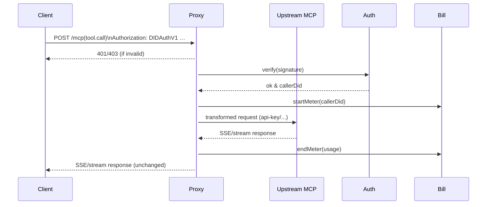

# MCP Server Proxy – Design Document

## 1. Motivation
Nuwa 生态中的部分 MCP 服务（**Model Capability Providers**）尚未完成基于 **NIP-10 DIDAuthV1** 的身份认证改造，导致无法直接被其它 Nuwa 应用（客户端、Agent、服务等）安全地调用。

为解决过渡期的兼容性问题，设计 **MCP Server Proxy**，在代理层完成身份验证、计费与协议转换，使得：

1. Nuwa 客户端始终以 **DIDAuthV1** 进行调用，不感知后端真实 MCP 的认证方式；  
2. 现有仅支持 `api-key`、`basic-auth` 或 **无认证** 的 MCP 依旧可被安全使用；  
3. 仅支持 **stdio** 工作模式的 MCP 可被转换为 **httpStream/SSE** 模式暴露；  
4. 未来可在代理层统一加入 **usage metering & billing** 逻辑。

## 2. 功能目标

| # | 功能 | 说明 |
|---|------|------|
| 1 | DIDAuth 身份认证 | 代理入口校验 `Authorization: DIDAuthV1 …`，拒绝未通过验证的请求。 |
| 2 | Upstream 认证转换 | 根据配置把请求注入 `api-key` / `basic-auth` / Bearer Token 等字段后再转发到目标 MCP。 |
| 3 | stdio → httpStream 转换 | 挂载 **stdio 模式 MCP** 的 stdin/stdout，并将其流式输出通过 **Server-Sent Events (SSE)** 暴露为 httpStream。 |
| 4 | 计费钩子 | 所有请求与响应都会经过 `preHandle` / `postHandle` 钩子，可在此统计 token 用量并写入账单。 |
| 5 | 多租户支持 | 不同调用方可路由到独立的 **upstream**，并使用各自计费策略。 |

## 3. 高层架构
```mermaid
graph TD
  A[Client / Agent] -- DIDAuthV1 --> P(MCP Server Proxy)
  P -- httpStream / SSE --> U1[Upstream MCP (httpStream)]
  P -- stdio wrapper --> U2[Upstream MCP (stdio)]
  subgraph Proxy Components
    P
    subgraph Auth & Billing
      Auth[DIDAuth Validator]
      Bill[Usage Meter]
    end
    Router[Request Router]
    Adapter[Protocol Adapter]
  end
  P --> Auth
  P --> Bill
  P --> Router
  Router --> Adapter
```

### 3.1 组件说明
1. **Auth (DIDAuth Validator)**: 使用 `@nuwa-ai/identity-kit` 验证 `Authorization` 头，产出 `callerDid`。  
2. **Router**: 根据路径 / `callerDid` / `tool.name` 决定转发到哪个 **Upstream**。  
3. **Adapter**: 负责：
   - 注入 **Upstream** 所需的认证信息（api-key/basic-auth/...）；
   - 根据 **Upstream** 协议差异（stdStream / httpStream）进行转换；
   - 将响应封装为 **SSE** 并转发给客户端。
4. **Billing**: 在请求完成后，根据 `usage` Header 或解析结果（例如 OpenAI 风格 `x-usage-tokens`）累加用量。

## 4. 流程时序


## 5. 配置文件 (YAML)
```yaml
# nuwa-services/mcp-server-proxy/config.yaml
listen: 0.0.0.0:8088

# 默认 upstream，当无其它匹配时使用
defaultUpstream: openrouter

upstreams:
  openrouter:
    type: httpStream
    baseURL: https://openrouter.ai/mcp
    auth:
      scheme: header
      header: Authorization
      value: "Bearer <OPENROUTER_API_KEY>"
  internal-llm:
    type: stdio
    command: ["./my-llm-binary", "--mcp-stdio"]
    cwd: /opt/llm
  # 亦可支持 basic-auth 等
  legacy-mcp:
    type: httpStream
    baseURL: https://legacy.example.com/mcp
    auth:
      scheme: basic
      username: alice
      password: secret

routes:
  # 基于 tool 名称路由到指定 upstream
  - matchTool: echo
    upstream: internal-llm
  # 基于 caller DID 前缀路由
  - matchDidPrefix: did:rooch:test:0x1234
    upstream: openrouter
```

## 6. 关键实现要点
1. **实现方式**：建议使用 **Fastify** + `undici`(fetch)；stdStream 适配器用 `child_process.spawn` 挂载。  
2. **DIDAuth 库**：直接引用 `@nuwa-ai/identity-kit` 的 `DIDAuth.v1.verifyAuthHeader`。  
3. **SSE 框架**：`fastify-sse-v2` 或自行实现 `text/event-stream` 头部。  
4. **限流 / 重试**：可集成 `@fastify/rate-limit` 与重试中间件，确保上游稳定性。

## 7. 迭代计划
- **v0.1 (MVP)**: 支持 httpStream 转发 + DIDAuth 校验 + 固定 api-key 注入。  
- **v0.2**: 支持 stdio 适配与 SSE 转换；基础计费（记录 token counts）。  
- **v0.3**: 可插拔 Billing Provider；多租户配置热加载；Prometheus 指标。  
- **v1.0**: 生产就绪，支持高可用部署、动态路由、细粒度计费策略。

## 8. 技术选型与核心依赖（已确定采用 TypeScript）

| 维度 | 选型 | 原因 |
|------|------|------|
| 运行时 | **Node.js ≥ 20** | 原生 `fetch/stream` 支持、LTS 长期维护，Nuwa JS 生态统一 |
| 语言 | **TypeScript 5.x** | 类型安全、与 `fastmcp` / `identity-kit` 等 Nuwa 包零摩擦 |
| Web 框架 | **Fastify** | 高性能、插件生态（SSE、rate-limit）、链式生命周期钩子方便集成 Auth/计费 |
| MCP 协议库 | **fastmcp** (server & client) | 官方实现，负责解析/构造 MCP 报文，可直接调用上游 MCP |
| DIDAuth | `@nuwa-ai/identity-kit` | Nuwa 官方库，支持 NIP-10 DIDAuthV1 验证 |
| HTTP 客户端 | **undici** / `fastmcp` 内置 client | 原生 Fetch API & 流式 body 支持，性能优于 axios |
| SSE 插件 | `fastify-sse-v2` | 快速构建 `text/event-stream` 响应，亦可根据需要自定义 |
| 进程管理 | **pm2** / **docker** / **k8s** | 支持热重载、日志收集、水平扩容 |
| 构建工具 | **esbuild** / **bun build** | 极快 TS 转译；开发阶段用 `tsx --watch` 热更新 |
| 测试 | **vitest** + **supertest** | 同步 TypeScript 配置，Mock HTTP 方便做路由/计费单测 |

### 8.1 项目目录草案
```
nuwa-services/mcp-server-proxy/
├── src/
│   ├── server.ts        # Fastify 启动文件
│   ├── auth.ts          # DIDAuth 中间件
│   ├── billing.ts       # 用量统计 & 账单逻辑
│   ├── router.ts        # Host/Tool 路由 -> upstream 映射
│   ├── adapter/
│   │   ├── http.ts      # httpStream → httpStream 适配器
│   │   └── stdio.ts     # stdio → SSE 适配器
│   └── types.ts         # 配置 & 上下文类型定义
├── config.yaml          # 上述示例配置
├── package.json         # 依赖与脚本
└── tsconfig.json
```

### 8.2 开发脚本
```json
"scripts": {
  "dev": "tsx watch src/server.ts",
  "build": "esbuild src/server.ts --bundle --platform=node --target=node20 --sourcemap --outfile=dist/index.js",
  "start": "node dist/index.js",
  "test": "vitest"
}
```

> 首个 MVP 将按此技术栈落地，后续若需高并发优化，可评估同协议的 Go/Rust 实现再行迁移。

---

> 本文档仅描述设计方案，具体实现请参见 `src/` 目录中的代码与配置示例。 

## 9. 项目安装与使用

### 9.1 安装依赖

```bash
# 使用 pnpm 安装依赖
cd nuwa-services/mcp-server-proxy
pnpm install
```

### 9.2 配置

1. 复制示例配置文件并根据需要修改：

```bash
# 如果需要，可以复制并修改配置文件
cp config.yaml config.local.yaml
```

2. 设置环境变量（可选）：

```bash
# 设置配置文件路径
export CONFIG_PATH=./config.local.yaml

# 设置上游服务的 API 密钥
export OPENROUTER_API_KEY=your_api_key_here
export LEGACY_USERNAME=username
export LEGACY_PASSWORD=password
```

### 9.3 开发模式运行

```bash
pnpm dev
```

### 9.4 构建与生产环境运行

```bash
# 构建项目
pnpm build

# 运行生产环境
pnpm start
```

### 9.5 测试

```bash
# 运行测试
pnpm test

# 监视模式运行测试
pnpm test:watch
```

### 9.6 Docker 部署（未来支持）

```bash
# 构建 Docker 镜像
docker build -t mcp-server-proxy .

# 运行 Docker 容器
docker run -p 8088:8088 -v $(pwd)/config.yaml:/app/config.yaml mcp-server-proxy
```

## 10. 故障排除

### 10.1 常见问题

1. **上游连接失败**
   - 检查上游服务是否可用
   - 验证 API 密钥是否正确
   - 检查网络连接

2. **DIDAuth 验证失败**
   - 确保客户端发送了正确的 `Authorization: DIDAuthV1 ...` 头
   - 检查 VDR 配置是否正确

3. **stdio 进程崩溃**
   - 检查命令路径是否正确
   - 查看进程日志以获取更多信息

### 10.2 日志

日志级别可以在配置文件中设置：

```yaml
server:
  logger:
    level: "debug"  # 可选值: trace, debug, info, warn, error, fatal
    prettyPrint: true
```

---

> 本文档描述了 MCP Server Proxy 的设计方案和使用方法。如有问题或建议，请提交 Issue 或 Pull Request。 

### JSON-RPC vs REST-like paths

The proxy understands **both** calling styles:

| Style | Example Request | When to use |
|-------|-----------------|-------------|
| REST-like | `POST /mcp/tool.call`<br>`{ "name": "echo", "arguments": { ... } }` | FastMCP TypeScript servers, Context7 demo, etc. |
| JSON-RPC | `POST /mcp` with body `{ "jsonrpc":"2.0", "method":"tools/call", ... }` | LiteLLM MCP Server, Python FastMCP, historical clients. |

Rules:
1. `GET /mcp` always returns a **200** SSE stream (keep-alive) so JSON-RPC clients can establish a long connection.
2. `POST /mcp` is internally mapped to `/mcp/tools` or `/mcp/tool.call` depending on `method`.
3. Unknown methods return JSON-RPC error `-32601`. 

## 配置

### 配置文件路径

配置文件默认位于项目根目录下的 `config.yaml`。可以通过环境变量 `CONFIG_PATH` 指定自定义配置文件路径：

```bash
# 使用自定义配置文件启动服务
CONFIG_PATH=/path/to/your/config.yaml node dist/index.js
```

### 环境变量替换

配置文件中可以使用 `${ENV_VAR_NAME}` 语法引用环境变量，在服务启动时会自动替换为对应的环境变量值：

```yaml
upstreams:
  litellm-mcp:
    type: "httpStream"
    baseURL: "http://localhost:4000/mcp"
    auth:
      scheme: "header"
      header: "Authorization"
      value: "Bearer ${LITELLM_MCP_API_KEY}"
```

启动服务时设置环境变量：

```bash
LITELLM_MCP_API_KEY=your_api_key node dist/index.js
```

## 路由规则

当前版本支持基于主机名的路由规则，可以在配置文件中指定：

```yaml
routes:
  - matchHostname: "context7.mcp-proxy.local"
    upstream: "context7"
```

## 开发

### 构建

```bash
npm run build
```

### 运行

```bash
npm start
```

### 测试

```bash
npm test
``` 